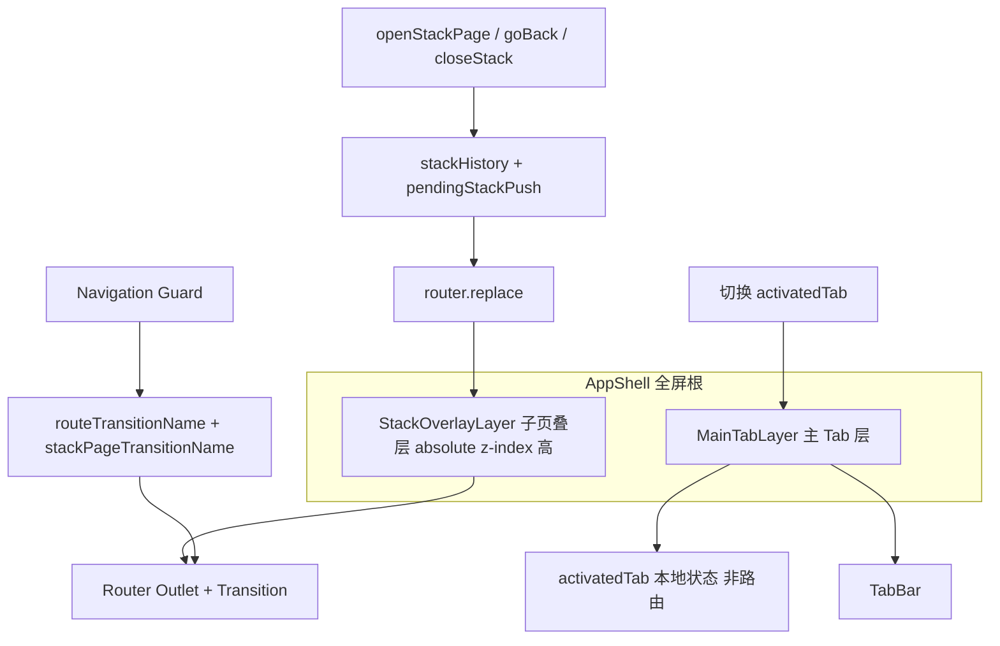

# SPA Native App Framework

框架无关的「Web SPA 模拟原生 App」整体设计。Vue2 为参考实现；**Vue3** 见 [Vue3 兼容性](#vue3-兼容性)；React 见各节的 **React 映射**。

- 通用机制详解：[references/transition-animation.md](references/transition-animation.md)、[references/replace-navigation.md](references/replace-navigation.md)、[references/scroll-restore-and-keepalive.md](references/scroll-restore-and-keepalive.md)、[references/business-callback-target.md](references/business-callback-target.md)
- hiking 样例对照：[references/hiking-reference.md](references/hiking-reference.md)
- 可复制 SCSS：[assets/page-transition.template.scss](assets/page-transition.template.scss)、[assets/stack-page-layout.template.scss](assets/stack-page-layout.template.scss)

## When to use

**适用：**

- 底部 Tab 主页 + Push 子页（详情、表单、设置）
- 需要 slide 转场、返回保留列表滚动/状态
- 扫码、拍照、地图选点、选人等全屏能力需要在 H5 SPA 中复用
- 混合应用（Cordova / Capacitor）全屏壳层
- 路由表需区分公开页与需登录页

**不适用：**

- 纯后台管理、无 Tab 的单栈站点
- 每个 Tab 独立 URL 且需 SEO 的站点（宜用多入口或 SSR）

## Core pattern



### 双轨导航

| 层 | 职责 | 导航方式 |
|----|------|----------|
| **MainTabLayer** | 3~5 个 Tab 根视图常驻 | `activatedTab`，**不**改 URL |
| **StackOverlayLayer** | 详情/表单等子页 | **replace 导航**：`openStackPage` / `goBack` + `stackHistory`，URL 反映当前子页但浏览器 history 不增长 |

根路由仅占位：`{ path: '/', name: 'AppShell' }`。子页叠层在 `pathname !== '/'`（或等价条件）时显示。

### 语义化命名约定

实现时统一使用下列名称（勿用 `selected`、`nl` 等缩写）：

| 概念 | 推荐名称 | 避免 |
|------|----------|------|
| 当前激活的 Tab id | `activatedTab` | `selected`, `tab` |
| 子页叠层是否可见 | `isStackOverlayVisible` | 仅靠隐式路由 |
| 全屏能力组件显隐 | `scannerVisible` / `pickerVisible` | `/scan` 中间页驱动所有场景 |
| 业务结果回调目标 | 调用方局部 `handleXSuccess` | 全局 `scanReturnTarget` 承担新业务 |
| 路由转场 CSS 名（外层叠层） | `routeTransitionName` | `pageTransition` |
| 栈内 router-view 转场名（内层） | `stackPageTransitionName` | 与外层共用同名 |
| 应用内栈历史 | `stackHistory` | 浏览器 `history.length` / `router.go(-1)` |
| 待确认压栈项 | `pendingStackPush` | 导航前直接写入 `stackHistory` |
| 替换式打开子页 | `openStackPage(to)` | `router.push(to)` |
| 应用内返回 | `goBack()` | 裸 `router.back()` / `router.go(-1)` |
| 清空栈回首页 | `closeStack()` | 连续多次浏览器 back |
| replace 导航滚动位置 | `scrollTops[routeName]` | 仅依赖 `route.meta.scrollTop` |
| 一次性覆盖转场（外层 + 内层） | `overrideTransitionName` | `firstTransition` |
| 一次性覆盖转场（**仅内层**） | `overrideStackPageTransitionName` | `innerTransition` |
| keep-alive 路由名列表 | `cachedRouteNames` | `cachedRoutes` |
| 主 Tab 层是否隐藏 | `isMainTabLayerHidden` | `show-sub-page` 类名可保留为 CSS |
| 懒加载 Tab 组件表 | `lazyTabComponents` | `MapComp` |
| 路由需登录 | `meta.requiresLogin` | `nl`, `needLogin` 缩写 |
| 是否子页间切换 | `isStackToStackNavigation` | `subTransition` |

## Implementation checklist

### 1. 路由表（Route table）

```javascript
// 默认缓存的列表页（组件名 === 路由 name）
export const defaultCachedRouteNames = ['ProductList', 'OrderList']

export const routes = [
  // 壳层占位：不渲染 Tab 内容，仅标记「在主页」
  { path: '/', name: 'AppShell' },

  // 公开子页
  { path: '/login', name: 'Login', component: () => import('./pages/Login') },
  { path: '/product/:id', name: 'ProductDetail', component: () => import('./pages/ProductDetail') },

  // 需登录子页 — meta.requiresLogin: true
  { path: '/profile', name: 'Profile', component: () => import('./pages/Profile'),
    meta: { requiresLogin: true } },
  { path: '/orders', name: 'OrderList', component: () => import('./pages/OrderList'),
    meta: { requiresLogin: true } },
]
```

规则：

- `AppShell` 路由无 component 或空组件，Tab 内容由 App 壳直接挂载
- 子页路由 **不要** 与 Tab id 混用同一路径
- 列表页需要返回保态：加入 `defaultCachedRouteNames`，且 **组件 `name` 与路由 `name` 一致**

### 2. 导航守卫（Auth + transition + cache）

守卫顺序建议：

1. **鉴权**：`requiresLogin` 且无 token → 弹窗/跳转登录，`return` 阻断
2. **转场名**：计算 `routeTransitionName`（外层）与 `stackPageTransitionName`（内层，见 [双层 transition 分工](#双层-transition-分工)）；`overrideTransitionName` 优先且用后清空；**仅覆盖内层** 用 `overrideStackPageTransitionName`
3. **叠层 DOM**：前进时延迟隐藏 MainTabLayer；返回 AppShell 时恢复
4. **动态缓存**：`slide-right` 且 from 非 AppShell → `addCachedRouteName(from.name)`
5. `next()` / `return true` 前将两个转场名写入全局状态供壳层 `<transition>` 使用

```javascript
// Vue Router 2 — 鉴权片段（语义化 meta）
router.beforeEach(async (to, from, next) => {
  const isAuthenticated = !!store.getters.authToken

  if (to.meta?.requiresLogin && !isAuthenticated) {
    const goLogin = await confirmLoginDialog() // 项目 UI
    if (goLogin) router.replace({ path: '/login' }) // replace 导航：不增长浏览器 history
    return // 阻断导航
  }

  let routeTransitionName = store.state.overrideTransitionName
  if (!routeTransitionName) {
    if (to.name === 'AppShell') routeTransitionName = 'slide-left'
    else if (from.name === 'AppShell') routeTransitionName = 'slide-right'
    else routeTransitionName = 'slide-right'
  } else {
    store.commit('CLEAR_OVERRIDE_TRANSITION')
  }

  applyMainTabLayerVisibility(routeTransitionName, to, from)
  if (routeTransitionName === 'slide-right' && from.name && from.name !== 'AppShell') {
    store.dispatch('addCachedRouteName', from.name)
  }

  store.commit('SET_ROUTE_TRANSITION', routeTransitionName)
  store.commit('SET_STACK_PAGE_TRANSITION', resolveStackPageTransitionName(routeTransitionName, to, from))
  next()
})

function resolveStackPageTransitionName(routeTransitionName, to, from) {
  if (from.name === 'AppShell') return ''   // 压栈：内层无动画，避免与外层双重 slide
  if (to.name === 'AppShell') return 'fade' // 回主页：内层淡出，避免内容随外层 slide 瞬间消失
  return routeTransitionName                 // 栈内 A↔B：内层 slide
}
```

**React 映射：** `react-router` v6 用 `<BrowserRouter>` + 自定义 `useNavigationGuard` 或在 layout 内 `useEffect` 监听 `location`；鉴权用 `<ProtectedRoute requiresLogin />` 或 loader 内 `redirect('/login')`。转场用 `framer-motion` 的 `AnimatePresence` + 全局 context 存 `routeTransitionName`。

### 3. App 壳模板（Vue2）

Tab UI 可替换 Mint UI / Vant / 自研；结构不变。

```vue
<template>
  <div id="app-shell">
    <!-- MainTabLayer -->
    <div class="main-tab-layer" :class="{ 'main-tab-layer--hidden': isMainTabLayerHidden }">
      <mt-tab-container v-model="activatedTab">
        <mt-tab-container-item id="Home"><home /></mt-tab-container-item>
        <mt-tab-container-item id="Discover"><discover /></mt-tab-container-item>
        <mt-tab-container-item id="Profile"><profile-tab /></mt-tab-container-item>
      </mt-tab-container>
      <mt-tabbar v-model="activatedTab">...</mt-tabbar>
    </div>

    <!-- StackOverlayLayer — 双层 transition，绑定不同 name（见下） -->
    <!-- 外层 routeTransitionName：AppShell ↔ 子叠层 进出场 -->
    <transition :name="routeTransitionName">
      <div v-show="isStackOverlayVisible" class="stack-overlay-layer">
        <!-- 内层 stackPageTransitionName：叠层内子路由 A↔B；与 AppShell 交界时无 slide / fade -->
        <transition :name="stackPageTransitionName">
          <keep-alive :include="cachedRouteNames">
            <router-view />
          </keep-alive>
        </transition>
      </div>
    </transition>
  </div>
</template>

<script>
import { mapGetters } from 'vuex'

export default {
  data() {
    return {
      activatedTab: 'Home',
      lazyTabComponents: {} // 按需: lazyTabComponents.Map = MapView
    }
  },
  computed: {
    ...mapGetters(['routeTransitionName', 'stackPageTransitionName', 'cachedRouteNames']),
    isStackOverlayVisible() {
      return this.$route.path !== '/'
    }
  },
  methods: {
  }
}
</script>
```

```scss
#app-shell { width: 100%; height: 100%; overflow: hidden; }
.main-tab-layer { height: 100%; width: 100%; overflow: hidden; }
.main-tab-layer--hidden { display: none; } // 或由守卫在 slide-right 后 500ms 添加
.stack-overlay-layer {
  position: absolute; z-index: 3; top: 0; left: 0; right: 0; height: 100%;
  overflow: hidden;
  overscroll-behavior: contain; // 子页滚到顶/底时不把滚动链传到 body 或 MainTabLayer
}
```

**双层 transition 分工：**

两层 `<transition>` **职责不同，且应绑定不同的 `name`**。若内外层共用同一 `routeTransitionName`，会在 AppShell ↔ 子页边界出现 **双重 slide**（压栈时叠层与页面各滑一次），或回主页时 **内层内容瞬间消失**（外层 slide 时内层无 leave 过渡）。

| 层 | 绑定 | 触发场景 | 动画对象 |
|----|------|----------|----------|
| **外层** | `routeTransitionName` | `AppShell`（`/`）↔ 任意子路由 | 整个 `.stack-overlay-layer` 容器 slide 进出场 |
| **内层** | `stackPageTransitionName` | 叠层 **内部** 子路由切换 | `router-view` 页面组件根 |

**内层 `stackPageTransitionName` 决策（守卫内计算，写入 store）：**

| from | to | `routeTransitionName`（外层） | `stackPageTransitionName`（内层） | 用户感知 |
|------|-----|------------------------------|-----------------------------------|----------|
| `AppShell` | 子页 | `slide-right` | `''`（空，无动画） | 仅叠层自右滑入，页面内容随容器同步出现 |
| 子页 | `AppShell` | `slide-left` | `fade` | 叠层向右滑出；内层子页 **opacity 淡出**，避免内容硬切 |
| 子页 | 子页 | `slide-right` / `slide-left` | 同外层 slide 名 | 栈内两页并行横滑 |
| 任意 | 任意 | `overrideTransitionName` | 按上表规则派生 | `goBack()` 仍先设 `slide-left` |

```javascript
function resolveStackPageTransitionName(routeTransitionName, to, from, store) {
  if (store?.state.overrideStackPageTransitionName != null) {
    const name = store.state.overrideStackPageTransitionName
    store.commit('CLEAR_OVERRIDE_STACK_PAGE_TRANSITION')
    return name
  }
  if (from.name === 'AppShell') return ''
  if (to.name === 'AppShell') return 'fade'
  return routeTransitionName
}
```

Vue 3 中 `name` 为空字符串时 Transition **不应用**命名 class（等价于无动画）。`fade` 时长与 slide 一致（0.5s），与外层并行。

外层配合 **`v-show`**（勿用 `v-if`）：回到 `/` 时仅隐藏叠层，保留 DOM，配合 `keep-alive` 避免高频子页每次从 Tab 进入都整栈重载。

**动画期间路由根绝对定位（转场必备）：** 内层并行 enter/leave 时两棵页面根须同坐标系横滑。推荐在转场 SCSS 为 `{name}-enter-active` / `{name}-leave-active` 设 `position: absolute !important`（已写入 [page-transition.template.scss](assets/page-transition.template.scss)），对任意 `router-view` 根生效；常态布局可另见 [stack-page-layout.template.scss](assets/stack-page-layout.template.scss)。

**叠层滚动隔离：** `overflow: hidden` + `overscroll-behavior: contain`（iOS 支持有限，见 Optional extensions）。

**React 映射：**

```tsx
// AppShell.tsx — 概念结构
const [activatedTab, setActivatedTab] = useState('Home')
const { routeTransitionName, cachedRouteNames } = useShellStore()
const location = useLocation()
const isStackOverlayVisible = location.pathname !== '/'

return (
  <div id="app-shell">
    <div className={cn('main-tab-layer', isMainTabLayerHidden && 'main-tab-layer--hidden')}>
      <TabBar activeKey={activatedTab} onChange={setActivatedTab} />
      <TabPanels activeKey={activatedTab}>{/* Home | Discover | Profile */}</TabPanels>
    </div>
    <AnimatePresence mode="wait">
      {isStackOverlayVisible && (
        <motion.div className="stack-overlay-layer" /* variants from routeTransitionName */>
          <Routes>{/* stack routes */}</Routes>
        </motion.div>
      )}
    </AnimatePresence>
  </div>
)
```

### 4. 全局状态（Vuex 示例）

```javascript
// store/modules/navigation.js
const state = {
  routeTransitionName: 'fade',
  stackPageTransitionName: '',
  overrideTransitionName: null,
  // 仅覆盖内层 stackPageTransitionName；外层 routeTransitionName 仍按 to/from 计算
  overrideStackPageTransitionName: null,
  cachedRouteNames: [...defaultCachedRouteNames],
  refreshOnBack: false,
  scrollTops: {},
  stackHistory: [],
  pendingStackPush: null,
}
// actions: setRouteTransition, setStackPageTransitionName,
//          setOverrideTransition (use 后 clear), setOverrideStackPageTransition (use 后 clear),
//          addCachedRouteName, removeCachedRouteName,
//          setPendingStackPush, commitPendingStackPush, popStackEntry, resetStack,
//          setScrollTop, getScrollTop, clearScrollTop
```

### 5. replace 导航：返回与前进 API

H5 / 微信内置浏览器推荐使用 **replace 导航**：应用内跳转全部 `router.replace()`，返回链由 `stackHistory` 自维护，避免浏览器 history 增长导致微信底部前进/后退栏出现。

```javascript
const APP_SHELL_PATH = '/'

function snapshotRoute(route) {
  return { path: route.path, query: { ...route.query }, hash: route.hash }
}

function openStackPage(to) {
  navigationStore.setPendingStackPush(snapshotRoute(router.currentRoute.value))
  router.replace(to)
}

function goBack(shouldRefreshOnBack = false, autoTransition = true) {
  if (autoTransition) navigationStore.setOverrideTransition('slide-left')
  if (shouldRefreshOnBack) navigationStore.setRefreshOnBack(true)
  const prev = navigationStore.popStackEntry()
  router.replace(prev ?? { path: APP_SHELL_PATH })
}

function closeStack(transitionName = 'slide-left') {
  navigationStore.resetStack()
  navigationStore.setOverrideTransition(transitionName)
  router.replace(APP_SHELL_PATH)
}

router.afterEach((to, from, failure) => {
  if (failure) {
    navigationStore.clearPendingStackPush()
    return
  }
  navigationStore.commitPendingStackPush()
})
```

详解：[references/replace-navigation.md](references/replace-navigation.md)。

**React：** `navigate(to, { replace: true })` + store/context 自维护 `stackHistory`；`goBack()` 时 `popStackEntry()` 后 `navigate(prev ?? '/', { replace: true })`。

### 6. 转场 CSS

**必须** 引入 [assets/page-transition.template.scss](assets/page-transition.template.scss)（或等效实现），类名/时长/translate 与 [references/transition-animation.md](references/transition-animation.md) 一致。禁止自造 transition 名或改 enter/leave 方向。

## 子栈导航核心机制（通用）

子页 A↔B 除壳层与守卫外，框架级能力如下（实现任一 H5 SPA 栈导航时需整体配套）。

### 机制一：转场动画（`routeTransitionName` + `stackPageTransitionName` + SCSS）

| 导航 | 外层 `routeTransitionName` | 内层 `stackPageTransitionName` | 用户感知 |
|------|---------------------------|-------------------------------|----------|
| 压栈 AppShell→B | `slide-right` | `''` | 叠层自右入；内层无二次 slide |
| 出栈 B→AppShell | `slide-left` | `fade` | 叠层向右出；子页淡出 |
| 栈内 A→B | `slide-right` | `slide-right` | 两页并行横滑 |
| 栈内 B→A | `slide-left` | `slide-left` | 两页并行横滑 |

- 守卫写入 store → 壳层 **外层** `:name="routeTransitionName"`、**内层** `:name="stackPageTransitionName"`
- **内层**栈间切换：并行 enter+leave + 转场 class 上 `position:absolute !important` → 约 0.5s 两页同坐标系横滑
- 返回务必 `goBack()`：`setOverrideTransition('slide-left')`，replace 导航下再 `popStackEntry()` + `router.replace(prev)`，否则 B→A 可能误用 `slide-right`

详表、keyframes、双页并列原理：[references/transition-animation.md](references/transition-animation.md)

### 机制二：replace 导航（`stackHistory` + `router.replace`）

1. 应用内打开子页：`openStackPage(to)` 先 `setPendingStackPush(currentRoute)`，再 `router.replace(to)`
2. `router.afterEach` 成功后 `commitPendingStackPush()`，失败时清理 pending
3. 应用内返回：`goBack()` 弹 `stackHistory`，再 `router.replace(prev ?? '/')`
4. 关闭整个栈：`closeStack()` 清空 `stackHistory`，replace 回 AppShell
5. 不使用浏览器 history 作为主返回链，避免微信内置浏览器底部前进/后退栏

详解：[references/replace-navigation.md](references/replace-navigation.md)

### 机制三：动态 keep-alive（A→B 缓存 A）

1. `defaultCachedRouteNames` 初始化 `cachedRouteNames`
2. 压栈且 `from.name !== 'AppShell'` → `addCachedRouteName(from.name)`
3. `<keep-alive :include="cachedRouteNames">`；组件 `name` === 路由 `name`
4. 返回时 A 走 `activated`，不重建列表 data / Tab

详流程：[references/scroll-restore-and-keepalive.md](references/scroll-restore-and-keepalive.md#1-动态-keep-aliveab-时缓存-a)

### 机制四：滚动位置恢复（B→A）

1. **离开 A**：`StackPage` / 页面容器在 `onDeactivated` 保存真实滚动容器 scrollTop
2. **replace 导航下存储**：写入 store `scrollTops[routeName]`，不要只依赖 `route.meta.scrollTop`
3. **回到 A**：`onActivated` 中确认 `cachedRouteNames` 含 A 后恢复 scrollTop
4. **转场兜底**：`nextTick + requestAnimationFrame` 先恢复一次，`setTimeout(520ms)` 在 slide 结束后再兜底一次
5. **返回刷新**：`goBack(true)` 设置 `refreshOnBack`，恢复逻辑消费后清零并重置滚动

详流程与 mixin 骨架：[references/scroll-restore-and-keepalive.md](references/scroll-restore-and-keepalive.md#2-滚动位置恢复ba)

### 机制五：业务能力组件化（扫码 / 选图 / 选人 / 地图选点）

1. 全屏能力组件通过 `Teleport to="body"` 覆盖当前页面，不占用 Stack 中间路由
2. 组件只负责采集结果和释放资源，统一 emit `success` / `cancel` / `error`
3. 调用方决定成功后的行为：当前页处理、回填表单、或进入结果页
4. 取消时不修改 `stackHistory`，自然停留调用页面
5. 非安全 HTTP 环境需提供 file/capture 兜底；取消时先 emit 隐藏，再清理资源

详流程与 FullScreenScanner 实战：[references/business-callback-target.md](references/business-callback-target.md)

### 守卫决策简表

| from | to | `routeTransitionName`（外层） | `stackPageTransitionName`（内层） |
|------|-----|------------------------------|-----------------------------------|
| `AppShell` | 子页 | `slide-right` | `''` |
| 子页 | 子页 | `slide-right`（压栈默认） | `slide-right` |
| 子页 | `AppShell` | `slide-left` | `fade` |
| 任意 | 任意 | `overrideTransitionName` | 按 `resolveStackPageTransitionName` 派生（**外层值会传染到内层**） |
| 任意 | 任意 | 按 `to/from` 默认 | `overrideStackPageTransitionName`（**外层不动**） |

压栈：`slide-right` + from 子页 → `addCachedRouteName(from.name)`；+ from AppShell → 延迟隐藏 MainTabLayer。

### 双轨覆盖转场 API

框架提供 **两个独立** 的一次性覆盖转场 API，作用域严格分离：

| API | 覆盖 | 典型场景 | 反例（请改用） |
|-----|------|----------|----------------|
| `setOverrideTransition(name)` | **外层 + 内层** | `goBack` 强制 `slide-left`；旧全屏路由页特殊入场 | 组件化全屏能力入场请用组件内 transition |
| `setOverrideStackPageTransition(name)` | **仅内层**（StackPage） | 只换子页动画，外层容器保持默认 slide 语义 | 想同时改两层时用 `setOverrideTransition` |

**优先级**：若同时设置了 `overrideTransitionName` 与 `overrideStackPageTransitionName`：
- 外层 = `overrideTransitionName`
- 内层 = `overrideStackPageTransitionName`（**独立内层值优先生效**，不会被外层传染）

**使用规范**：

```javascript
// 场景：goBack 强制外层 slide-left（replace 导航）
function goBack() {
  store.dispatch('setOverrideTransition', 'slide-left')
  const prev = store.dispatch('popStackEntry')
  router.replace(prev ?? { path: '/' })
}

// 旧模式：/scan 仍作为 StackPage 路由时，只让内层用 fade-in
function onLegacyScanClick() {
  store.dispatch('setOverrideStackPageTransition', 'fade-in')
  openStackPage({ path: '/scan' })
}

// 新模式：扫码已组件化时，不走路由转场
function onScanClick() {
  scannerVisible.value = true
}
```

**反模式**：

- 用 `setOverrideTransition` 同时覆盖两层，且内外层方向不同 → 视觉错位
- 用 `setOverrideStackPageTransition` 改外层动画 → 不会生效，写错位置
- 在 `setOverrideStackPageTransition` 之后又 `setOverrideTransition`，内层被覆盖为外层传染值 → 想内层独立需在 `setOverrideTransition` **之后**再设

## Keep-alive contract（摘要）

1. `include` 项为路由 **name** 字符串；组件 `name` 必须一致
2. **A→B 压栈** 时动态 `addCachedRouteName(from.name)`（见机制三）
3. `defaultCachedRouteNames` 不可被 `removeCachedRouteName` 移除
4. React：`react-activation` 或自管 cache Map

## Auth route design

| meta | 含义 |
|------|------|
| `requiresLogin: true` | 无 token 阻断，引导登录 |
| `requiresLogin: false` | 显式公开（可选，与未定义同效） |
| 未定义 | 公开访问 |

登录成功后跳回 `redirect` query 或默认 `AppShell`。

**React ProtectedRoute 骨架：**

```tsx
function ProtectedRoute({ children }: { children: React.ReactNode }) {
  const token = useAuthToken()
  const location = useLocation()
  if (!token) return <Navigate to="/login" state={{ from: location }} replace />
  return <>{children}</>
}
```

## Anti-patterns

- 内外层 `<transition>` 共用同一 `routeTransitionName` → AppShell 边界双重 slide 或回主页内容硬切
- 用 `setOverrideTransition` 试图只改内层 → 会**连带影响**外层（内层在非 AppShell 边界时继承外层值）。只改内层应改用 `setOverrideStackPageTransition`
- 用 `setOverrideStackPageTransition` 改外层动画 → 不会生效，写错位置
- 用 `/home`、`/me` 路由驱动 Tab 切换 → Tab 状态丢失、转场错乱
- 应用内子页导航裸用 `router.push()` → 浏览器 history 增长，微信内置浏览器可能出现底部前进/后退栏
- 应用内返回裸用 `router.go(-1)` / `router.back()` → 绕过 `stackHistory`，replace 导航语义失效
- `openStackPage()` 导航前直接写 `stackHistory`，不通过 `pendingStackPush` → 导航失败/重定向后栈污染
- replace 导航下滚动位置只写 `route.meta.scrollTop` → 路由 meta 复用/替换时机导致恢复不可靠
- Tab 页与子页共用同一路由 name
- `include` 与组件 `name` 不一致导致缓存失效
- 守卫未 `return` 阻断未登录导航
- 仅在子组件内算转场、壳层无统一 `routeTransitionName`
- 用 `/scan` 中间路由承载所有扫码业务，导致成功/取消/重新扫码都要修 stackHistory
- 全屏能力组件关闭时先做耗时清理、后 emit 隐藏 → file/capture 取消后黑屏残留
- React 中在 Tab 层再套一层 `<Routes>` 导致双 outlet 竞争
- 移动端 input / textarea `font-size < 16px` → iOS Safari 自动放大视口（见 [transition-animation §10](references/transition-animation.md#10-ios-safari-自动放大聚焦-input-触发视口缩放实战经验)）

## Optional extensions

- **replace 导航**：H5 / 微信内置浏览器优先 `stackHistory + router.replace`，不要依赖浏览器 history 返回（见 [replace-navigation](references/replace-navigation.md)）
- **replace 导航滚动恢复**：滚动位置写入 store `scrollTops[routeName]`；`StackPage` 用 `onDeactivated` 保存、`onActivated` 恢复（见 [scroll-restore-and-keepalive](references/scroll-restore-and-keepalive.md)）
- **栈子页 input 字号 ≥ 16px**：iOS Safari 聚焦时若 < 16px 会自动放大视口；搜索/表单页聚焦元素显式覆盖（与 [transition-animation §10](references/transition-animation.md#10-ios-safari-自动放大聚焦-input-触发视口缩放实战经验) 配合）
- **全屏能力组件**：扫码/拍照/地图选点优先做成 `Teleport` 组件，入场组件内 `fade-in`、退出无动画；业务成功回调由调用方编排（见 [business-callback-target](references/business-callback-target.md)）
- **子页滚动穿透（尤其 iOS）**：叠层必备 `overscroll-behavior: contain`；子页内容区单独 `overflow-y: auto` + 固定高度；iOS 可试 `overscroll-behavior-y: none`、滚动容器全屏 fixed，或边界 `touchmove` 条件 `preventDefault`
- **重 Tab 懒加载**：首次 `activatedTab === 'Map'` 再赋值 `lazyTabComponents.Map`
- **右滑返回**：触摸结束后 `setOverrideTransition('slide-left')` + `goBack()`
- **安全区 TabBar**：`padding-bottom: env(safe-area-inset-bottom)`
- **状态栏**：壳层 watch `statusBarTheme`，转场 delay 300ms 再改原生 StatusBar
- **统计**：Tab 切换手动上报；子页在守卫 `onPageStart/End`

## Vue3 兼容性

本模式依赖的能力在 Vue3 **均未删除**，但用法有破坏性变更。按下列对照改造后，skill 中的守卫、命名、双轨导航逻辑**可直接复用**。

### 仍可用（语义不变）

| 能力 | Vue2 | Vue3 |
|------|------|------|
| `<keep-alive :include="string[]">` | ✓ | ✓ |
| `<transition :name="routeTransitionName">` | ✓ | ✓（需配合 `key` / 动态组件） |
| 全局 `beforeEach` 写 `routeTransitionName` | Vue Router 3 | Vue Router 4（返回值风格见下） |
| 组件 `name` 供 include 匹配 | `export default { name }` | `<script setup>` 需 `defineOptions({ name })`（3.3+） |
| Vuex 存转场状态 | ✓ | Vuex 4 或 **Pinia**（推荐新项目） |

### 必须改写的点

**1. `<router-view>` 不能单独作为 `<transition>` 的直接子节点**

Vue3 中异步路由组件需通过 slot 取出再包 transition + keep-alive：

```vue
<!-- StackOverlayLayer — Vue3 / Vue Router 4 -->
<transition :name="routeTransitionName">
  <div v-show="isStackOverlayVisible" class="stack-overlay-layer">
    <router-view v-slot="{ Component, route }">
      <transition :name="stackPageTransitionName">
        <keep-alive :include="cachedRouteNames">
          <component
            :is="Component"
            v-if="Component"
            :key="route.name ?? route.path"
            class="stack-page"
          />
        </keep-alive>
      </transition>
    </router-view>
  </div>
</transition>
```

双层 `<transition>` 在 Vue3 保留：**外层** `routeTransitionName` 管叠层容器；**内层** `stackPageTransitionName` 管栈内路由切换（与 AppShell 交界时为空或 `fade`，见 [双层 transition 分工](#双层-transition-分工)）。内层必须 `v-slot` + `<component :is>` + `:key`。

**2. Vue Router 4 导航守卫**

`next()` 在 Vue Router 4 中已标记废弃，推荐：

```javascript
router.beforeEach(async (to, from) => {
  if (to.meta?.requiresLogin && !authToken.value) {
    const ok = await confirmLogin()
    return ok ? { path: '/login' } : false  // false = 取消导航
  }
  const routeTransitionName = resolveTransition(to, from)
  const stackPageTransitionName = resolveStackPageTransitionName(routeTransitionName, to, from, navigationStore)
  navigationStore.setRouteTransition(routeTransitionName)
  navigationStore.setStackPageTransitionName(stackPageTransitionName)
  applyMainTabLayerVisibility(routeTransitionName, to, from)
  return true
})
```

返回主页时仍设 `slide-left`；replace 导航下 `goBack()` 先 `setOverrideTransition('slide-left')`，再 `popStackEntry()` + `router.replace(prev ?? '/')`。

**3. `<script setup>` 与 keep-alive `include`**

Vue3 单文件组件默认无 `name`，`:include="['OrderList']"` 不生效。任选其一：

```javascript
// Vue 3.3+
defineOptions({ name: 'OrderList' })
```

或对列表页保留 Options API 的 `name` 字段。`<script setup>` 下**没有** Vue2 的隐式 name 推断。

**4. 已移除、与本模式无关的 Vue2 API**

以下删除**不影响**本 shell 设计：`$on`/`$off`、`filters`、`.sync`（改用 `v-model:prop`）、`$children`。不要在这些已删 API 上构建 Tab/栈导航。

**5. UI 与入口**

- Mint UI `mt-tab-container` 面向 Vue2；Vue3 项目用 Vant 4、NutUI 等，**只替换 Tab 组件**，`activatedTab` + 双轨导航不变。
- 应用入口：`createApp(App).use(router).use(pinia).mount('#app')`。

### Vue2 → Vue3 壳层对照

| 项目 | Vue2 | Vue3 |
|------|------|------|
| 叠层 router-view | `<keep-alive><router-view/></keep-alive>` | `v-slot` + `<component :is>` + `:key` |
| 双层 transition | 外 `routeTransitionName` / 内 `stackPageTransitionName` | 相同 |
| 守卫 | `next()` | `return true / false / route` |
| 状态 | Vuex 3 | Pinia 或 Vuex 4 |
| `setOverrideStackPageTransition` (内层) | `setOverrideStackPageTransition(name)` | 相同 |
| `setOverrideTransition` (外层 + 内层) | `setOverrideTransition(name)` | 相同 |
| 回到主页 | 外 `slide-left` + 内 `fade` | 相同 |

## Vue → React quick map

| Vue2 / Vue3 | React |
|------|-------|
| `activatedTab` + Tab 容器 | `useState` + Tab UI 库 |
| `router-view` / `v-slot` in overlay | `<Routes>` in overlay `div` |
| `keep-alive :include` | cache Map / `react-activation` |
| `router.beforeEach` | `ProtectedRoute` + layout `useEffect` |
| Vuex/Pinia `routeTransitionName` + `stackPageTransitionName` | Context / Zustand |
| `<transition :name>` | `framer-motion` / `react-transition-group` |
| `meta.requiresLogin` | route handle `requiresAuth` 或 wrapper |
| `router.replace` + `stackHistory` | `navigate(to, { replace: true })` + store `stackHistory` |
| `popStackEntry()` + `router.replace(prev ?? '/')` | `popStackEntry()` + `navigate(prev ?? '/', { replace: true })` |
| 回到主页 `slide-left` | 同上命名，exit 动画向右滑出 |

## Additional resources

- [references/transition-animation.md](references/transition-animation.md) — 转场 CSS 规范、双页滑动原理、守卫设定
- [references/replace-navigation.md](references/replace-navigation.md) — replace 导航、stackHistory、goBack/closeStack
- [references/scroll-restore-and-keepalive.md](references/scroll-restore-and-keepalive.md) — 动态 keep-alive、replace 导航下滚动恢复、检查清单
- [assets/page-transition.template.scss](assets/page-transition.template.scss) — slide keyframes
- [assets/stack-page-layout.template.scss](assets/stack-page-layout.template.scss) — 叠层内页面根 absolute 布局
- [references/hiking-reference.md](references/hiking-reference.md) — hiking 样例、legacy 命名、LineList 案例
