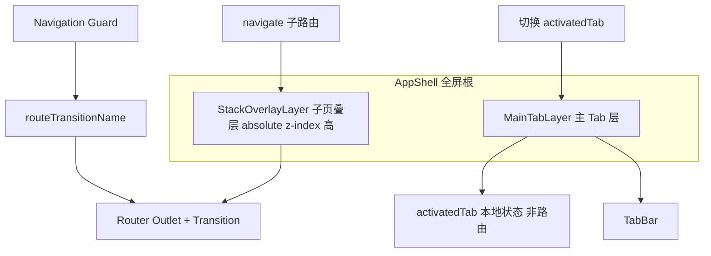

# SPA Native App Framework

框架无关的「Web SPA 模拟原生 App」整体设计。Vue2 为参考实现；**Vue3** 见 [Vue3 兼容性](#vue3-兼容性)；React 见各节的 **React 映射**。

详细 hiking 对照见 [references/hiking-reference.md](references/hiking-reference.md)。

## When to use

**适用：**

- 底部 Tab 主页 + Push 子页（详情、表单、设置）
- 需要 slide 转场、返回保留列表滚动/状态
- 混合应用（Cordova / Capacitor）全屏壳层
- 路由表需区分公开页与需登录页

**不适用：**

- 纯后台管理、无 Tab 的单栈站点
- 每个 Tab 独立 URL 且需 SEO 的站点（宜用多入口或 SSR）

## Core pattern



### 双轨导航

| 层 | 职责 | 导航方式 |
|----|------|----------|
| **MainTabLayer** | 3~5 个 Tab 根视图常驻 | `activatedTab`，**不**改 URL |
| **StackOverlayLayer** | 详情/表单等子页 | 路由器 `push` / `pop`，URL 反映子页 |

根路由仅占位：`{ path: '/', name: 'AppShell' }`。子页叠层在 `pathname !== '/'`（或等价条件）时显示。

### 语义化命名约定

实现时统一使用下列名称（勿用 `selected`、`nl` 等缩写）：

| 概念 | 推荐名称 | 避免 |
|------|----------|------|
| 当前激活的 Tab id | `activatedTab` | `selected`, `tab` |
| 子页叠层是否可见 | `isStackOverlayVisible` | 仅靠隐式路由 |
| 路由转场 CSS 名 | `routeTransitionName` | `pageTransition` |
| 一次性覆盖转场 | `overrideTransitionName` | `firstTransition` |
| keep-alive 路由名列表 | `cachedRouteNames` | `cachedRoutes` |
| 主 Tab 层是否隐藏 | `isMainTabLayerHidden` | `show-sub-page` 类名可保留为 CSS |
| 懒加载 Tab 组件表 | `lazyTabComponents` | `MapComp` |
| 路由需登录 | `meta.requiresLogin` | `nl`, `needLogin` 缩写 |
| 是否子页间切换 | `isStackToStackNavigation` | `subTransition` |

## Implementation checklist

### 1. 路由表（Route table）

```javascript
// 默认缓存的列表页（组件名 === 路由 name）
export const defaultCachedRouteNames = ['ProductList', 'OrderList']

export const routes = [
  // 壳层占位：不渲染 Tab 内容，仅标记「在主页」
  { path: '/', name: 'AppShell' },

  // 公开子页
  { path: '/login', name: 'Login', component: () => import('./pages/Login') },
  { path: '/product/:id', name: 'ProductDetail', component: () => import('./pages/ProductDetail') },

  // 需登录子页 — meta.requiresLogin: true
  { path: '/profile', name: 'Profile', component: () => import('./pages/Profile'),
    meta: { requiresLogin: true } },
  { path: '/orders', name: 'OrderList', component: () => import('./pages/OrderList'),
    meta: { requiresLogin: true } },
]
```

规则：

- `AppShell` 路由无 component 或空组件，Tab 内容由 App 壳直接挂载
- 子页路由 **不要** 与 Tab id 混用同一路径
- 列表页需要返回保态：加入 `defaultCachedRouteNames`，且 **组件 `name` 与路由 `name` 一致**

### 2. 导航守卫（Auth + transition + cache）

守卫顺序建议：

1. **鉴权**：`requiresLogin` 且无 token → 弹窗/跳转登录，`return` 阻断
2. **转场名**：计算 `routeTransitionName`（见下表）；`overrideTransitionName` 优先且用后清空
3. **叠层 DOM**：前进时延迟隐藏 MainTabLayer；返回 AppShell 时恢复
4. **动态缓存**：`slide-right` 且 from 非 AppShell → `addCachedRouteName(from.name)`
5. `next()` 前将 `routeTransitionName` 写入全局状态供壳层 `<transition>` 使用

```javascript
// Vue Router 2 — 鉴权片段（语义化 meta）
router.beforeEach(async (to, from, next) => {
  const isAuthenticated = !!store.getters.authToken

  if (to.meta?.requiresLogin && !isAuthenticated) {
    const goLogin = await confirmLoginDialog() // 项目 UI
    if (goLogin) router.push({ path: '/login' })
    return // 阻断导航
  }

  let routeTransitionName = store.state.overrideTransitionName
  if (!routeTransitionName) {
    if (to.name === 'AppShell') routeTransitionName = 'slide-left'
    else if (from.name === 'AppShell') routeTransitionName = 'slide-right'
    else routeTransitionName = 'slide-right'
  } else {
    store.commit('CLEAR_OVERRIDE_TRANSITION')
  }

  applyMainTabLayerVisibility(routeTransitionName, to, from)
  if (routeTransitionName === 'slide-right' && from.name && from.name !== 'AppShell') {
    store.dispatch('addCachedRouteName', from.name)
  }

  store.commit('SET_ROUTE_TRANSITION', routeTransitionName)
  next()
})
```

**React 映射：** `react-router` v6 用 `<BrowserRouter>` + 自定义 `useNavigationGuard` 或在 layout 内 `useEffect` 监听 `location`；鉴权用 `<ProtectedRoute requiresLogin />` 或 loader 内 `redirect('/login')`。转场用 `framer-motion` 的 `AnimatePresence` + 全局 context 存 `routeTransitionName`。

### 3. App 壳模板（Vue2）

Tab UI 可替换 Mint UI / Vant / 自研；结构不变。

```vue
<template>
  <div id="app-shell">
    <!-- MainTabLayer -->
    <div class="main-tab-layer" :class="{ 'main-tab-layer--hidden': isMainTabLayerHidden }">
      <mt-tab-container v-model="activatedTab">
        <mt-tab-container-item id="Home"><home /></mt-tab-container-item>
        <mt-tab-container-item id="Discover"><discover /></mt-tab-container-item>
        <mt-tab-container-item id="Profile"><profile-tab /></mt-tab-container-item>
      </mt-tab-container>
      <mt-tabbar v-model="activatedTab">...</mt-tabbar>
    </div>

    <!-- StackOverlayLayer -->
    <transition :name="routeTransitionName">
      <div v-show="isStackOverlayVisible" class="stack-overlay-layer">
        <transition :name="routeTransitionName">
          <keep-alive :include="cachedRouteNames">
            <router-view />
          </keep-alive>
        </transition>
      </div>
    </transition>
  </div>
</template>

<script>
import { mapGetters } from 'vuex'

export default {
  data() {
    return {
      activatedTab: 'Home',
      lazyTabComponents: {} // 按需: lazyTabComponents.Map = MapView
    }
  },
  computed: {
    ...mapGetters(['routeTransitionName', 'cachedRouteNames']),
    isStackOverlayVisible() {
      return this.$route.path !== '/'
    }
  },
  methods: {
  }
}
</script>
```

```scss
#app-shell { width: 100%; height: 100%; overflow: hidden; }
.main-tab-layer { height: 100%; width: 100%; overflow: hidden; }
.main-tab-layer--hidden { display: none; } // 或由守卫在 slide-right 后 500ms 添加
.stack-overlay-layer {
  position: absolute; z-index: 3; top: 0; left: 0; right: 0; height: 100%;
  overflow: hidden;
  overscroll-behavior: contain; // 子页滚到顶/底时不把滚动链传到 body 或 MainTabLayer
}
```

**叠层滚动隔离：** `overflow: hidden` 约束叠层自身不撑开外壳；`overscroll-behavior: contain` 阻止子页内滚动到边界后继续「橡皮筋」带动底层 Tab 或整页（Android Chrome / 部分桌面浏览器有效）。**iOS Safari 对该属性支持有限**，hiking 注释已标明；若子页仍有穿透，需在子页滚动容器上使用 `-webkit-overflow-scrolling: touch` 并限制滚动区域高度，或配合 `touch-action` / 阻止 `touchmove` 冒泡（见 Optional extensions）。

**React 映射：**

```tsx
// AppShell.tsx — 概念结构
const [activatedTab, setActivatedTab] = useState('Home')
const { routeTransitionName, cachedRouteNames } = useShellStore()
const location = useLocation()
const isStackOverlayVisible = location.pathname !== '/'

return (
  <div id="app-shell">
    <div className={cn('main-tab-layer', isMainTabLayerHidden && 'main-tab-layer--hidden')}>
      <TabBar activeKey={activatedTab} onChange={setActivatedTab} />
      <TabPanels activeKey={activatedTab}>{/* Home | Discover | Profile */}</TabPanels>
    </div>
    <AnimatePresence mode="wait">
      {isStackOverlayVisible && (
        <motion.div className="stack-overlay-layer" /* variants from routeTransitionName */>
          <Routes>{/* stack routes */}</Routes>
        </motion.div>
      )}
    </AnimatePresence>
  </div>
)
```

### 4. 全局状态（Vuex 示例）

```javascript
// store/modules/navigation.js
const state = {
  routeTransitionName: 'fade',
  overrideTransitionName: null,
  cachedRouteNames: [...defaultCachedRouteNames]
}
// actions: setRouteTransition, setOverrideTransition(clear after use)
// actions: addCachedRouteName, removeCachedRouteName
```

### 5. 返回与前进 API

```javascript
// mixin / composable: useStackNavigation
function goBack(shouldRefreshOnBack = false) {
  store.dispatch('setOverrideTransition', 'slide-left')
  if (shouldRefreshOnBack) store.dispatch('setRefreshOnBack', true)
  router.go(-1)
}

function openStackPage(path) {
  router.push(path) // 守卫自动 slide-right
}
```

**React：** `useNavigate(-1)` 前 `setOverrideTransition('slide-left')`。

### 6. 转场 CSS

提供 `slide-right`（压栈）、`slide-left`（回到主页）、`fade`（特殊页）。使用 `translate3d` + 约 0.5s。见 [返回主页时的动画区别](#返回主页时的动画区别) 与 reference 中 SCSS。

## 返回主页时的动画区别

「回到主页」指路由目标为 `AppShell`（`path === '/'`），叠层隐藏、MainTabLayer 重新可交互。动画名**不是**随意取的，而是与原生「压栈 / 出栈」方向绑定。

### 动画名与视觉语义（勿混淆）

| `routeTransitionName` | 用户感知 | 进入页（enter） | 离开页（leave） | 典型场景 |
|----------------------|----------|----------------|-----------------|----------|
| **`slide-right`** | 压栈、前进 | 自**右**滑入 | 向**左**滑出 | AppShell → 子页；子页 → 子页 |
| **`slide-left`** | 出栈、回到 Tab | 自**左**滑入（露出底层主页） | 向**右**滑出 | 子页 → AppShell（常规返回） |
| **`fade`** | 渐隐切换 | 透明度 | 透明度 | 如 Map → AppShell 且已设 `override` 时的特例 |

命名约定：**`slide-left` = 回到主页**，**`slide-right` = 打开或前进子页**。CSS 类前缀与方向一致（`slide-left-enter` 使用 `slideInLeft`，自左侧 -100% 进入）。

### 回到主页的两条路径（动画名必须一致）

两条路径都应让壳层最终使用 **`slide-left`**（除非走下面的 `fade` 特例），否则会出现「返回却像前进」的错位。

```text
路径 A — 守卫自动计算（浏览器后退、router.push('/') 等）
  条件: to.name === 'AppShell' && from.name !== 'Map'（且无 override）
  → routeTransitionName = 'slide-left'

路径 B — 业务主动返回（头部返回钮、goBack）
  1. setOverrideTransition('slide-left')   // 必须先于导航
  2. router.go(-1) 或 router.push('/')
  → 守卫读到 override，采用 slide-left，随后 clearOverrideTransition()
```

**与压栈对比：**

```text
压栈:  from AppShell → 子页     → slide-right（守卫默认）
       子页 A → 子页 B          → slide-right
返回:  子页 → AppShell          → slide-left（路径 A 或 B）
```

### 特例：Map → AppShell 使用 `fade`

当 **已存在** `overrideTransitionName`（通常来自 `goBack()`）且 `from.name === 'Map'`、`to.name === 'AppShell'` 时，hiking 将动画改为 **`fade`**，而**不是** `slide-left`，用于地图页退出时渐隐，避免与全屏地图 slide 冲突。实现时在 override 分支单独判断；其它子页返回仍用 `slide-left`。

### 守卫侧连带行为（仅 `slide-left` 回到主页时）

| `routeTransitionName` | 对 MainTabLayer 的影响 |
|----------------------|-------------------------|
| `slide-right` 且 from 为 AppShell | 约 500ms 后 `isMainTabLayerHidden = true` |
| **`slide-left` 且 to 为 AppShell** | **立即** 去掉 hidden，恢复 Tab 层 |
| `slide-right` 且 from 为子页 | `addCachedRouteName(from.name)` |

### 实现检查

- [ ] 返回按钮走 `goBack()`，不要裸 `router.go(-1)`（否则缺少 override，可能与守卫自动规则不一致）
- [ ] 文档/注释中写清：`slide-left` ≠ 「向左滑动屏幕」，而是「主页从左侧入屏的出栈动画」
- [ ] 子页叠层 `<transition :name="routeTransitionName">` 在回到 `/` 时收到的名称为 `slide-left`

## Transition rules（守卫决策简表）

| from | to | 默认 `routeTransitionName` | 备注 |
|------|-----|---------------------------|------|
| 子页（非 Map） | `AppShell` | **`slide-left`** | 路径 A：回到 Tab |
| `AppShell` | 子页 | **`slide-right`** | 压栈 |
| 子页 | 子页 | **`slide-right`** | 前进 |
| 任意 | 任意 | **`overrideTransitionName`** | 路径 B：`goBack()` 先设 **`slide-left`** |
| `Map` | `AppShell` | **`fade`** | 仅当已有 override 时（路径 B 从地图返回） |

压栈后约 500ms 为 `.main-tab-layer` 加 `--hidden`，避免触摸穿透。

## Keep-alive contract

1. `<keep-alive :include="cachedRouteNames">` 的项为**组件 name 字符串**
2. 组件 `export default { name: 'OrderList' }` 必须与路由 `name: 'OrderList'` 一致
3. 前进离开页时 `addCachedRouteName(from.name)`；默认列表在 `defaultCachedRouteNames` 初始化
4. **React：** 无 keep-alive；用 React Router 的持久化布局、`useOutlet` + 自管 cache Map，或 `react-activation`

## Auth route design

| meta | 含义 |
|------|------|
| `requiresLogin: true` | 无 token 阻断，引导登录 |
| `requiresLogin: false` | 显式公开（可选，与未定义同效） |
| 未定义 | 公开访问 |

登录成功后跳回 `redirect` query 或默认 `AppShell`。

**React ProtectedRoute 骨架：**

```tsx
function ProtectedRoute({ children }: { children: React.ReactNode }) {
  const token = useAuthToken()
  const location = useLocation()
  if (!token) return <Navigate to="/login" state={{ from: location }} replace />
  return <>{children}</>
}
```

## Anti-patterns

- 用 `/home`、`/me` 路由驱动 Tab 切换 → Tab 状态丢失、转场错乱
- Tab 页与子页共用同一路由 name
- `include` 与组件 `name` 不一致导致缓存失效
- 守卫未 `return` 阻断未登录导航
- 仅在子组件内算转场、壳层无统一 `routeTransitionName`
- React 中在 Tab 层再套一层 `<Routes>` 导致双 outlet 竞争

## Optional extensions

- **子页滚动穿透（尤其 iOS）**：叠层必备 `overscroll-behavior: contain`；子页内容区单独 `overflow-y: auto` + 固定高度；iOS 可试 `overscroll-behavior-y: none`、滚动容器全屏 fixed，或边界 `touchmove` 条件 `preventDefault`
- **重 Tab 懒加载**：首次 `activatedTab === 'Map'` 再赋值 `lazyTabComponents.Map`
- **右滑返回**：触摸结束后 `setOverrideTransition('slide-left')` + `goBack()`
- **安全区 TabBar**：`padding-bottom: env(safe-area-inset-bottom)`
- **状态栏**：壳层 watch `statusBarTheme`，转场 delay 300ms 再改原生 StatusBar
- **统计**：Tab 切换手动上报；子页在守卫 `onPageStart/End`

## Vue3 兼容性

本模式依赖的能力在 Vue3 **均未删除**，但用法有破坏性变更。按下列对照改造后，skill 中的守卫、命名、双轨导航逻辑**可直接复用**。

### 仍可用（语义不变）

| 能力 | Vue2 | Vue3 |
|------|------|------|
| `<keep-alive :include="string[]">` | ✓ | ✓ |
| `<transition :name="routeTransitionName">` | ✓ | ✓（需配合 `key` / 动态组件） |
| 全局 `beforeEach` 写 `routeTransitionName` | Vue Router 3 | Vue Router 4（返回值风格见下） |
| 组件 `name` 供 include 匹配 | `export default { name }` | `<script setup>` 需 `defineOptions({ name })`（3.3+） |
| Vuex 存转场状态 | ✓ | Vuex 4 或 **Pinia**（推荐新项目） |

### 必须改写的点

**1. `<router-view>` 不能单独作为 `<transition>` 的直接子节点**

Vue3 中异步路由组件需通过 slot 取出再包 transition + keep-alive：

```vue
<!-- StackOverlayLayer — Vue3 / Vue Router 4 -->
<router-view v-slot="{ Component, route }">
  <transition :name="routeTransitionName">
    <keep-alive :include="cachedRouteNames">
      <component
        :is="Component"
        v-if="Component"
        :key="route.fullPath"
        class="stack-page"
      />
    </keep-alive>
  </transition>
</router-view>
```

双层 `<transition>`（hiking App.vue 中外层包 `v-show` 的 div、内层包 `router-view`）在 Vue3 可保留，但**内层**必须采用上述 `v-slot` 写法；外层仅对叠层容器做进出场时可保留。

**2. Vue Router 4 导航守卫**

`next()` 在 Vue Router 4 中已标记废弃，推荐：

```javascript
router.beforeEach(async (to, from) => {
  if (to.meta?.requiresLogin && !authToken.value) {
    const ok = await confirmLogin()
    return ok ? { path: '/login' } : false  // false = 取消导航
  }
  const routeTransitionName = resolveTransition(to, from) // 逻辑同 Vue2
  navigationStore.setRouteTransition(routeTransitionName)
  applyMainTabLayerVisibility(routeTransitionName, to, from)
  return true
})
```

返回主页时仍设 `slide-left`；`goBack()` 仍先 `setOverrideTransition('slide-left')` 再 `router.back()`。

**3. `<script setup>` 与 keep-alive `include`**

Vue3 单文件组件默认无 `name`，`:include="['OrderList']"` 不生效。任选其一：

```javascript
// Vue 3.3+
defineOptions({ name: 'OrderList' })
```

或对列表页保留 Options API 的 `name` 字段。`<script setup>` 下**没有** Vue2 的隐式 name 推断。

**4. 已移除、与本模式无关的 Vue2 API**

以下删除**不影响**本 shell 设计：`$on`/`$off`、`filters`、`.sync`（改用 `v-model:prop`）、`$children`。不要在这些已删 API 上构建 Tab/栈导航。

**5. UI 与入口**

- Mint UI `mt-tab-container` 面向 Vue2；Vue3 项目用 Vant 4、NutUI 等，**只替换 Tab 组件**，`activatedTab` + 双轨导航不变。
- 应用入口：`createApp(App).use(router).use(pinia).mount('#app')`。

### Vue2 → Vue3 壳层对照

| 项目 | Vue2 | Vue3 |
|------|------|------|
| 叠层 router-view | `<keep-alive><router-view/></keep-alive>` | `v-slot` + `<component :is>` + `:key` |
| 守卫 | `next()` | `return true / false / route` |
| 状态 | Vuex 3 | Pinia 或 Vuex 4 |
| 返回动画 | `setOverrideTransition('slide-left')` | 相同 |
| 回到主页动画名 | `slide-left` | 相同 |

## Vue → React quick map

| Vue2 / Vue3 | React |
|------|-------|
| `activatedTab` + Tab 容器 | `useState` + Tab UI 库 |
| `router-view` / `v-slot` in overlay | `<Routes>` in overlay `div` |
| `keep-alive :include` | cache Map / `react-activation` |
| `router.beforeEach` | `ProtectedRoute` + layout `useEffect` |
| Vuex/Pinia `routeTransitionName` | Context / Zustand |
| `<transition :name>` | `framer-motion` / `react-transition-group` |
| `meta.requiresLogin` | route handle `requiresAuth` 或 wrapper |
| 回到主页 `slide-left` | 同上命名，exit 动画向右滑出 |

## Additional resources

- [references/hiking-reference.md](references/hiking-reference.md) — hiking 对照、返回动画决策、Vue3 细节、legacy 命名
