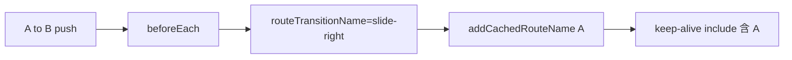

# Scroll restore and dynamic keep-alive（通用规范）

子栈 A→B→A 时，除转场外还需 **实例缓存** 与 **滚动位置恢复**。二者正交，需同时实现。

转场 CSS 见 [transition-animation.md](transition-animation.md)。replace 导航与应用内栈历史见 [replace-navigation.md](replace-navigation.md)。

## 1. 动态 keep-alive（A→B 时缓存 A）

### 目标

从列表 A 进入详情 B 再返回时，A 的 **data、Tab 索引、已请求列表** 不丢失，且不走 `created` 重载。

### 数据流



### 实现步骤（Vue 2/3 通用）

1. **路由表** 导出 `defaultCachedRouteNames`：需保态的路由 **name** 列表（列表页、带 Tab 的筛选页等）。

```javascript
export const defaultCachedRouteNames = ['ProductList', 'OrderList']
```

2. **Store** 维护 `cachedRouteNames`，初始值 `= [...defaultCachedRouteNames]`。

3. **壳层**：

```vue
<keep-alive :include="cachedRouteNames">
  <router-view />
</keep-alive>
```

4. **组件契约**：`export default { name: 'ProductList' }` 必须与 `name: 'ProductList'` 路由一致；Vue 3 `<script setup>` 用 `defineOptions({ name: 'ProductList' })`。

5. **导航守卫**（在 `savePageTransition` 之后、`next` 之前）：

```javascript
if (routeTransitionName === 'slide-right' && from.name && from.name !== 'AppShell') {
  addCachedRouteName(from.name) // 动态把 A 加入 include
}
```

6. **移除策略**：`removeCachedRouteName(name)` 时，**不得** 删除 `defaultCachedRouteNames` 中的项（常驻列表始终可缓存）。

### 与转场的关系

| `routeTransitionName` | keep-alive 动作 |
|----------------------|-----------------|
| `slide-right`（A→B） | `addCachedRouteName(from.name)`（from 非 AppShell 时） |
| `slide-left`（B→A） | 无新增；A 已在 include 中，实例 re-activate |

### React 映射

无内置 keep-alive：用 `react-activation`、layout 持久化 + Map 以 `route.name` 为 key，或在 pop 时不 unmount 列表 layout。

---

## 2. 滚动位置恢复（B→A）

### 2.0 replace 导航下的推荐存储

传统 push/pop 导航可把滚动位置写入 `route.meta.scrollTop`。但在 **replace 导航**下，页面历史由应用内 `stackHistory` 维护，`router.replace()` 会不断替换当前 history entry；不同路由实例的 `meta` 复用和时机更容易混淆。

推荐：滚动位置进入 navigation store，由 route name 作为 key。

```javascript
const state = {
  scrollTops: {}, // Record<routeName, scrollTop>
}

function setScrollTop(routeName, scrollTop) {
  if (routeName) scrollTops[routeName] = scrollTop
}

function getScrollTop(routeName) {
  if (!routeName) return null
  return routeName in scrollTops ? scrollTops[routeName] : null
}

function clearScrollTop(routeName) {
  if (routeName) delete scrollTops[routeName]
}
```

适用规则：

| 导航模式 | 推荐滚动存储 |
|----------|--------------|
| 浏览器 push/pop | `route.meta.scrollTop` 可用 |
| replace 导航 + `stackHistory` | store `scrollTops[routeName]` 更可靠 |

### 目标

返回 A 时，列表滚动条回到离开前的位置（与数据保态配合）。

### 保存：离开 A 时

#### Vue2 / push-pop 模式

在 **组件级** `beforeRouteLeave`（推荐全局 mixin，每个页面可覆盖选择器）：

| 配置项 | 说明 |
|--------|------|
| `scrollContainerSelector` | 真实滚动容器的 CSS 选择器，相对页面根 `$el` 查询 |
| 默认值 | `.bg-common`（全屏内容区） |
| 列表示例 | `.bg-common.PBottom-none .bar_content`（Tab 列表内层滚动） |

```javascript
beforeRouteLeave(to, from, next) {
  const el = this.$el.querySelector(this.scrollContainerSelector)
  if (el) {
    const scrollTop = el.scrollTop
    if (from.meta) from.meta.scrollTop = scrollTop
    else from.meta = { scrollTop }
  }
  next()
}
```

**为何不用守卫保存？** `beforeRouteLeave` 在 `beforeEach` **之前**执行；守卫里尚不宜仅靠 `cachedRouteNames` 判断是否保存。

#### Vue3 / replace 导航模式

若页面统一使用 `StackPage` 容器，可在容器内保存 `.stack-page__body` 的 scrollTop。注意：`onDeactivated` 时 `route` 可能已经变化，因此需要在激活时缓存当前路由名。

```javascript
const route = useRoute()
const navigationStore = useNavigationStore()
const bodyRef = ref(null)
const scrollRouteName = ref('')

function saveScrollPosition() {
  const name = scrollRouteName.value
  if (bodyRef.value && name) {
    navigationStore.setScrollTop(name, bodyRef.value.scrollTop)
  }
}

onMounted(() => {
  scrollRouteName.value = route.name || ''
})

onDeactivated(() => {
  saveScrollPosition()
})
```

关键点：

- 保存用 `scrollRouteName`，不要在 `onDeactivated` 里直接读 `route.name`。
- 滚动容器应固定，如 `StackPage` 的 `.stack-page__body`。
- replace 导航下滚动记录进入 store，不写 `route.meta.scrollTop`。

### 恢复：回到 A 的 `activated`

#### Vue2 / push-pop 模式

keep-alive 页面再次显示时触发 `activated`（不是 `mounted`）。须 **全部** 满足：

1. `this.$route.name === this.$options.name`（防止 keep-alive 内子组件误执行）
2. 非「返回刷新」分支（如 `pageBackRefresh === false`）
3. `this.$route.meta.scrollTop` 已定义
4. `cachedRouteNames.includes(this.$route.name)`

```javascript
activated() {
  if (this.$route.name !== this.$options.name) return
  if (this.pageBackRefresh) { /* ccRefreshPage / getData */ return }
  if (this.$route.meta?.scrollTop == null) return
  if (!this.cachedRouteNames.includes(this.$route.name)) return

  const el = this.$el.querySelector(this.scrollContainerSelector)
  if (el) {
    el.scrollTop = this.$route.meta.scrollTop
    this.$route.meta.scrollTop = 0
    this.removeCachedRouteName?.(this.$route.name) // 非 default 列表可选
  }
}
```

### 返回 API

#### replace 导航模式（推荐 H5）

replace 导航下不要 `router.go(-1)`，而是弹应用内 `stackHistory` 后 `router.replace(prev)`：

```javascript
function goBack(shouldRefreshOnBack = false, autoTransition = true) {
  if (autoTransition) navigationStore.setOverrideTransition('slide-left')
  if (shouldRefreshOnBack) navigationStore.setRefreshOnBack(true)

  const prev = navigationStore.popStackEntry()
  router.replace(prev ?? { path: '/' })
}
```

`refreshOnBack` 由 `StackPage` 的恢复逻辑消费：

```javascript
function restoreScrollPosition() {
  const name = scrollRouteName.value
  if (!name) return

  if (refreshOnBack.value) {
    navigationStore.setRefreshOnBack(false)
    if (bodyRef.value) bodyRef.value.scrollTop = 0
    navigationStore.clearScrollTop(name)
    return
  }

  const saved = navigationStore.getScrollTop(name)
  if (saved == null) return
  if (!cachedRouteNames.value.includes(name)) return

  const apply = () => {
    if (!bodyRef.value) return
    bodyRef.value.scrollTop = saved
    if (Math.abs(bodyRef.value.scrollTop - saved) < 2) {
      navigationStore.clearScrollTop(name)
    }
  }

  nextTick(() => {
    requestAnimationFrame(apply)
    setTimeout(apply, 520)
  })
}

onActivated(() => {
  scrollRouteName.value = route.name || ''
  restoreScrollPosition()
})
```

为什么同时 `requestAnimationFrame` 与 `setTimeout(520)`：

| 时机 | 作用 |
|------|------|
| `nextTick + requestAnimationFrame` | DOM 恢复后尽快写回滚动 |
| `setTimeout(520)` | 等 0.5s slide 转场结束后再兜底一次，避免动画/布局期间写入被覆盖 |

#### push-pop 模式

```javascript
function goBack(shouldRefresh = false) {
  setOverrideTransition('slide-left') // 与出栈动画一致
  if (shouldRefresh) setPageBackRefresh(true)
  router.go(-1)
}
```

**push-pop 模式不要**裸 `router.go(-1)`，否则可能缺少 `slide-left`，且与守卫自动规则不一致。**replace 导航模式禁止把浏览器 history 当作主返回链**，必须使用 [replace-navigation.md](replace-navigation.md) 中的 `stackHistory`。

### 与列表业务 mixin 的分工

| 能力 | replace 导航机制 | push-pop 兼容机制 |
|------|------------------|-------------------|
| 列表数据、Tab、分页 | keep-alive 保留组件 `data` | 同左 |
| 滚动条位置 | store `scrollTops[routeName]` + `activated` | `meta.scrollTop` + `activated` |
| 下拉刷新数据 | `refreshOnBack` / 列表 mixin 的 `pullDownDone` 等，与缓存实例共存 | pageBackRefresh / 列表 mixin |

---

## 3. 端到端时序（A 列表 → B 详情 → 返回 A）

```text
1. A 显示，用户滚动，scrollTop = 400
2. openStackPage(B) → setPendingStackPush(A) → router.replace(B)
3. afterEach 成功 → commitPendingStackPush(A)
4. guard: slide-right, keepRouteAlive(A)
5. A deactivated: store.scrollTops[A] = 400
6. B 显示；A deactivated 但未 destroy
7. goBack → override slide-left → popStackEntry 得到 A → router.replace(A)
8. A activated: 从 store.scrollTops[A] 恢复 400；列表 data 仍在
```

---

## 4. Agent 实现检查清单

- [ ] [page-transition.template.scss](../assets/page-transition.template.scss) 已引入
- [ ] replace 导航项目已实现 `stackHistory` / `pendingStackPush` / `router.replace`
- [ ] `defaultCachedRouteNames` 与路由/组件 `name` 一致
- [ ] 压栈时 `addCachedRouteName(from.name)`
- [ ] 列表页设置正确 `scrollContainerSelector` 或统一使用 `StackPage` 的滚动容器
- [ ] replace 导航下滚动位置写入 store `scrollTops[routeName]`，不是只写 `route.meta`
- [ ] `onDeactivated` 保存滚动时使用激活时缓存的 `scrollRouteName`
- [ ] `onActivated` 恢复滚动时使用 `requestAnimationFrame` + 转场结束兜底
- [ ] `goBack()` 使用 `slide-left` override，并在 replace 导航下 `popStackEntry()` 后 `router.replace()`

## 5. 参考样例（hiking）

`LineList` → `LinesDetails` → 返回：见 [hiking-reference.md](hiking-reference.md#example-linelist--linesdetails)。
