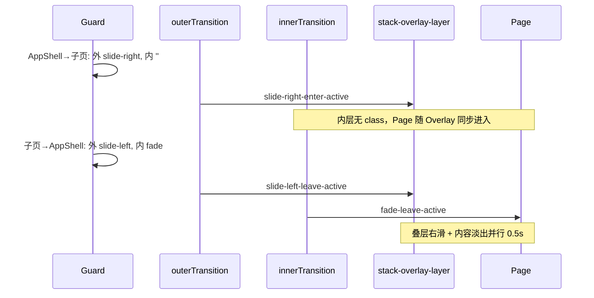
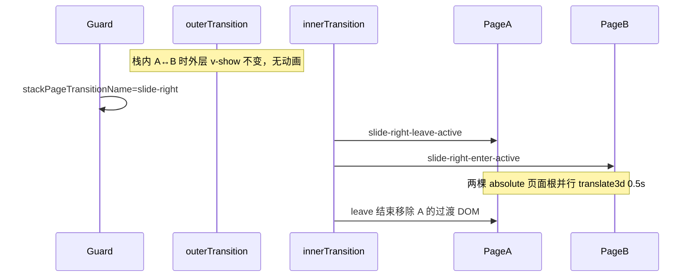

# Stack transition animation（通用规范）

本文件为 [SKILL.md](../SKILL.md) 的补充。新项目 **必须** 按此规范实现子页转场 CSS，与路由守卫写入的 `routeTransitionName` 严格一致。

可复制文件：

- 转场 keyframes：[../assets/page-transition.template.scss](../assets/page-transition.template.scss)
- 页面根绝对定位：[../assets/stack-page-layout.template.scss](../assets/stack-page-layout.template.scss)

## 1. 双层 transition 分工与双轨转场名

子页叠层使用 **两层** `<transition>`，但 **必须绑定不同的 `name`**：

| 状态字段 | 绑定层 | 职责 |
|----------|--------|------|
| `routeTransitionName` | **外层**（`.stack-overlay-layer` 容器） | `AppShell` ↔ 子路由叠层的 slide 进出场 |
| `stackPageTransitionName` | **内层**（`router-view` 页面组件） | 叠层 **内部** 子路由之间的切换 |

**反模式：** 内外层共用同一 `routeTransitionName` → 压栈时双重 slide；回主页时内层内容随外层 hard cut、无 leave 过渡。

### 1.1 壳层模板（Vue2 / Vue3 结构一致）

```vue
<!-- 外层：routeTransitionName -->
<transition :name="routeTransitionName">
  <div v-show="isStackOverlayVisible" class="stack-overlay-layer">
    <!-- 内层：stackPageTransitionName（≠ 外层） -->
    <transition :name="stackPageTransitionName">
      <keep-alive :include="cachedRouteNames">
        <!-- Vue3：v-slot + component :is + :key，见 SKILL.md -->
        <router-view />
      </keep-alive>
    </transition>
  </div>
</transition>
```

`isStackOverlayVisible` 通常为 `$route.path !== '/'`。外层用 **`v-show`**（非 `v-if`），回到 `/` 时仅隐藏叠层 DOM。

### 1.2 内层 `stackPageTransitionName` 决策

在 `beforeEach` 内与 `routeTransitionName` **一并**计算并写入 store：

```javascript
function resolveStackPageTransitionName(routeTransitionName, to, from) {
  if (from.name === 'AppShell') return ''    // 压栈：无内层动画
  if (to.name === 'AppShell') return 'fade'  // 回主页：内层淡出
  return routeTransitionName                  // 栈内 A↔B：与外层 slide 一致
}
```

| from | to | 外层 `routeTransitionName` | 内层 `stackPageTransitionName` | 效果 |
|------|-----|---------------------------|--------------------------------|------|
| `AppShell` | 子页 | `slide-right` | `''` | 仅叠层滑入；页面随容器同步出现 |
| 子页 | `AppShell` | `slide-left` | `fade` | 叠层滑出 + 子页 opacity 并行淡出 |
| 子页 | 子页 | `slide-right` / `slide-left` | 同名 slide | 栈内两页并行横滑 |

- Vue 3：`name` 为 `''` 时不应用命名 transition class（无动画）
- `fade` 时长 **0.5s**，与 slide 对齐，见 §6
- `overrideTransitionName` 只影响 **外层** `routeTransitionName`；内层仍按上表派生（`goBack` → 外 `slide-left` + 内 `fade`）

### 1.3 时序（AppShell → 子页 → 回 AppShell）



### 1.4 栈内切换（仅内层 slide）

| 层级 | 触发 | 动画对象 |
|------|------|----------|
| **外层** | `v-show` 恒 true，无动画 | — |
| **内层** | 子路由 ↔ 子路由 | `router-view` 组件根；`keep-alive` 缓存 + 并行 enter/leave |

## 2. 动画期间路由根节点必须脱离文档流（关键）

并行 enter/leave 时，**约 0.5s 内 DOM 上同时存在两个路由页面根节点**。若二者为默认文档流（`position: static`），会上下叠摞，**无法**形成横向「两页并列滑动」。

### 2.1 推荐（更通用）：在转场 class 上设 `absolute`

内层 `<transition :name="routeTransitionName">`（包 `router-view` 的那层）在动画进行时会为路由组件根节点挂上 `{name}-enter-active` / `{name}-leave-active`。**直接在转场 SCSS 中统一绝对定位**，不依赖每个页面是否写了 `.bg-html`：

```scss
// 已写入 page-transition.template.scss
.slide-left-enter-active,
.slide-left-leave-active,
.slide-right-enter-active,
.slide-right-leave-active {
  position: absolute !important;
  top: 0;
  left: 0;
  right: 0;
  width: 100%;
  min-height: 100%;
}
```

- 作用于 **router-view 输出的组件根元素**（transition 的直接动画目标）
- `!important` 用于压过页面内其它 `position` 定义，**仅在动画类存续期间**生效
- 动画结束后 class 移除，布局回到页面自身样式

**父级前提：** `.stack-overlay-layer` 为 `position:absolute; height:100%; overflow:hidden`，作为绝对定位 containing block。

### 2.2 补充（非动画态布局 / 滚动）

转场 class 只覆盖约 0.5s；页面**常态**仍建议顶层包裹绝对定位或满高，以统一滚动与叠层布局（尤其 Tab 内 `.bg-common` 为 `relative`、叠层内为 `absolute` 的区分）：

```scss
.stack-overlay-layer {
  .page-root, .bg-html {
    position: absolute;
    top: 0; left: 0; right: 0; bottom: 0;
    overflow-y: auto;
    transform: translate3d(0, 0, 0);
  }
}
```

模板：[../assets/stack-page-layout.template.scss](../assets/stack-page-layout.template.scss)  
参考（hiking）：`src/styles/base.scss` `.sub-page .bg-html` / `.bg-common`

**二者关系：** §2.1 保证**任意**子路由在切换动画中可并列横滑；§2.2 保证静止时滚动区域与壳层一致。可只用 §2.1，但生产项目常两者并存。

## 3. 类名与 keyframes 契约（严格）

Vue 2 会根据 `name` 自动加 `{name}-enter`、`{name}-enter-active`、`{name}-leave-active` 等类：

| `routeTransitionName` | enter 初始类 | enter-active | leave-active | 离开终点 |
|----------------------|--------------|--------------|--------------|----------|
| `slide-left` | `opacity:0; translate3d(-100%,0,0)` | `slideInLeft` **0.5s** | `slideOutRight` **0.5s** | `translate3d(100%,0,0)` + `visibility:hidden` |
| `slide-right` | `opacity:0; translate3d(100%,0,0)` | `slideInRight` **0.5s** | `slideOutLeft` **0.5s** | `translate3d(-100%,0,0)` + `visibility:hidden` |

统一：**`translate3d`** + **`0.5s`**。完整 keyframes 见 [page-transition.template.scss](../assets/page-transition.template.scss)。

### 导航语义

| 用户操作 | `routeTransitionName` |
|----------|----------------------|
| 压栈 A→B | `slide-right` |
| 出栈 B→A | `slide-left` |
| 特殊全屏页退出 | `fade`（可选） |

## 4. 守卫如何设定转场名

**外层 `routeTransitionName`：**

```javascript
if (overrideTransitionName) {
  transition = overrideTransitionName
  clearOverrideTransition()
} else if (to.name === 'AppShell') {
  transition = 'slide-left'
} else if (from.name === 'AppShell') {
  transition = 'slide-right'
} else {
  transition = 'slide-right'
}
```

**内层 `stackPageTransitionName`：** 见 §1.2 `resolveStackPageTransitionName`。

```javascript
// beforeEach 末尾
navigationStore.setRouteTransition(routeTransitionName)
navigationStore.setStackPageTransitionName(
  resolveStackPageTransitionName(routeTransitionName, to, from)
)
```

- `goBack()` 必须先 `setOverrideTransition('slide-left')` 再 `router.go(-1)`
- `slide-right` 且 from 子页 → `addCachedRouteName(from.name)`

## 5. 为何看到「两个页面并列滑动」（栈内切换）



- **仅内层** `<transition>` 在栈内切换时动画；外层不参与
- 内层默认**并行** enter/leave
- `keep-alive` 保留离开页实例；过渡 DOM 由 transition 管理
- **页面根 `absolute`** 是两页同屏横滑的前提（见 §2）

## 6. fade 扩展（内层回主页）

内层 `stackPageTransitionName === 'fade'` 时用于 **子页 → AppShell**：与外层 `slide-left` 并行，子页内容 opacity 淡出，避免外层滑动时内层硬切。

```scss
.fade-enter-active,
.fade-leave-active {
  transition: opacity 0.5s;
}

.fade-enter-from,
.fade-leave-to {
  opacity: 0;
}
```

Vue 2 项目可将 `fade-enter-from` 写作 `.fade-enter`。也可用于与 slide 栈语义冲突的全屏页（如地图退出 Tab）。

## 7. React 映射

- 双层：外层 AnimatePresence + `routeTransitionName` 控制 stack 显隐 slide；内层 + `stackPageTransitionName` 控制 route 切换（AppShell 边界：内层 none / fade）
- 每个 stack 页面根：`position: absolute; inset: 0`
- `framer-motion` 并行 exit/enter 模拟 slide-left/right；回主页内层用 opacity variant

## 8. 进入后立即聚焦 input 导致的页面抖动（实战经验）

### 现象

栈子页 A→B 压栈时（B 是搜索/输入类页面，习惯在 `onMounted` 或 `nextTick` 中 `inputRef.focus()`）：

- 外层 slide-right 动画 0.5s 进行中，新页从 `translate3d(100%, 0, 0)` 滑入
- `focus()` 在压栈动画 **第一帧** 就触发，移动端键盘随即弹出
- 键盘弹出引发**视口 reflow + input 元素 scrollIntoView**，新页 DOM 重排
- 重排与外层 `transform: translate3d` 动画叠加 → 视觉上呈现「页面瞬间出现 + 抖动」

开发者在桌面调试时**不易察觉**（无键盘、动画流畅），但移动端必现。

### 根因

转场 class 上 `position: absolute !important`（[§2.1](#21-推荐更通用在转场-class-上设-absolute)）和 `transform: translate3d` 只在动画期有效；这期间任何会改变**文档流 / 视口尺寸**的操作（键盘、滚动到位、固定元素位移）都会让外层 `transform` 看起来失效或错位。

| 触发动作 | 是否会引发布局变化 | 是否与 slide 叠加抖动 |
|---------|------------------|----------------------|
| `input.focus()`（移动端） | ✓（弹键盘、scrollIntoView） | ✓ |
| `textarea.focus()` | ✓ | ✓ |
| `select` 唤起下拉 | ✓ | 弱 |
| 同步 setState 修改 height/width | ✓ | ✓ |
| 修改 v-show 状态 | ✓ | 弱 |
| 同步 API 请求（无副作用） | ✗ | ✗ |
| 滚动到指定位置 | ✓ | ✓ |

### 解决方案

**核心：动画期间只做"无副作用的事"，聚焦 / 滚动 / 弹窗全部延后到动画结束后。**

#### 方案 A（推荐）：延迟到动画结束（500ms）后

```vue
<script setup>
import { ref, onMounted } from 'vue'

const inputRef = ref(null)

onMounted(() => {
  // slide 转场 0.5s；延时聚焦避开 reflow 与 transform 叠加
  setTimeout(() => {
    inputRef.value?.focus()
  }, 520)
})
</script>
```

**适用场景**：搜索页、表单填写页等「进入即输入」页面。

**优点**：实现最简单，对原有代码侵入最小。
**代价**：用户感知上「进入 → 0.5s 后光标才出现」，但 slide 动画本身已建立视觉过渡，对 UX 无负面。

#### 方案 B：监听 transitionend

```js
onMounted(() => {
  const body = document.querySelector('.stack-overlay-layer')
  if (!body) {
    inputRef.value?.focus()
    return
  }
  const handler = (e) => {
    if (e.target === body && e.propertyName === 'transform') {
      body.removeEventListener('transitionend', handler)
      inputRef.value?.focus()
    }
  }
  body.addEventListener('transitionend', handler)
})
```

**适用场景**：动画时长可能变化（自定义转场），需要更精确同步。
**代价**：代码更复杂；要处理 `transitionend` 不触发的兜底（`setTimeout` 备用）。

#### 方案 C：改用 keep-alive 的 `onActivated`

```js
onActivated(() => {
  // 仅 keep-alive 缓存的页面从缓存恢复时聚焦；首次进入仍走 onMounted
  inputRef.value?.focus()
})
```

**适用场景**：返回时希望自动还原焦点。**不能替代**首次进入的延迟聚焦。

### 反模式（不要这样做）

```js
// ❌ onMounted + nextTick 立即聚焦 → 移动端必抖
onMounted(() => {
  nextTick(() => inputRef.value?.focus())
})

// ❌ requestAnimationFrame 不够
onMounted(() => {
  requestAnimationFrame(() => inputRef.value?.focus())
})

// ❌ 用 setTimeout(0) 或微任务
onMounted(() => {
  Promise.resolve().then(() => inputRef.value?.focus())
})
```

以上三种都在动画开始后第一帧触发，无法避开 reflow。

### 检查清单

实现栈子页时，问自己：

- [ ] 该页进入后是否需要 `focus()` 输入框？
- [ ] 如果需要，**是否已用 `setTimeout(≥500ms)` 延后到 slide 动画结束？**
- [ ] 该页进入后是否触发 `scrollIntoView`、`window.scrollTo`、键盘弹起的副作用？
- [ ] 移动端真机 / 浏览器 DevTools 移动模拟验证过：**滑入过程无抖动**？

### 适用本规范的页面类型

| 页面类型 | 是否需要延迟 | 建议方案 |
|---------|------------|---------|
| 搜索页 | ✓ | setTimeout 520ms |
| 表单填写页 | ✓ | setTimeout 520ms |
| 详情页（无输入） | ✗ | — |
| 设置/列表页 | ✗ | — |
| 弹层/Toast | ✗ | — |

### 实际案例

Archive Hub H5「全局搜索页」曾出现：用户从首页点搜索进入，slide 动画进行到约 200ms 时键盘弹出，新页内容**整体抖动一下再继续滑入**。修复：[`search/index.vue`](../../../../www/dev/archive-hub-h5/src/views/search/index.vue) 将 `nextTick + focus()` 改为 `setTimeout(520ms)` 后，slide 动画可完整呈现，输入框在动画结束后才聚焦，移动端再无抖动。
