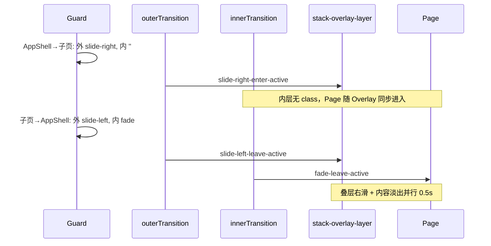
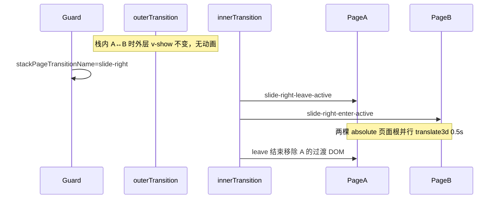

# Stack transition animation（通用规范）

本文件为 [SKILL.md](../SKILL.md) 的补充。新项目 **必须** 按此规范实现子页转场 CSS，与路由守卫写入的 `routeTransitionName` 严格一致。

可复制文件：

- 转场 keyframes：[../assets/page-transition.template.scss](../assets/page-transition.template.scss)
- 页面根绝对定位：[../assets/stack-page-layout.template.scss](../assets/stack-page-layout.template.scss)

## 1. 双层 transition 分工与双轨转场名

子页叠层使用 **两层** `<transition>`，但 **必须绑定不同的 `name`**：

| 状态字段 | 绑定层 | 职责 |
|----------|--------|------|
| `routeTransitionName` | **外层**（`.stack-overlay-layer` 容器） | `AppShell` ↔ 子路由叠层的 slide 进出场 |
| `stackPageTransitionName` | **内层**（`router-view` 页面组件） | 叠层 **内部** 子路由之间的切换 |

**反模式：** 内外层共用同一 `routeTransitionName` → 压栈时双重 slide；回主页时内层内容随外层 hard cut、无 leave 过渡。

### 1.1 壳层模板（Vue2 / Vue3 结构一致）

```vue
<!-- 外层：routeTransitionName -->
<transition :name="routeTransitionName">
  <div v-show="isStackOverlayVisible" class="stack-overlay-layer">
    <!-- 内层：stackPageTransitionName（≠ 外层） -->
    <transition :name="stackPageTransitionName">
      <keep-alive :include="cachedRouteNames">
        <!-- Vue3：v-slot + component :is + :key，见 SKILL.md -->
        <router-view />
      </keep-alive>
    </transition>
  </div>
</transition>
```

`isStackOverlayVisible` 通常为 `$route.path !== '/'`。外层用 **`v-show`**（非 `v-if`），回到 `/` 时仅隐藏叠层 DOM。

### 1.2 内层 `stackPageTransitionName` 决策

在 `beforeEach` 内与 `routeTransitionName` **一并**计算并写入 store：

```javascript
function resolveStackPageTransitionName(routeTransitionName, to, from) {
  if (from.name === 'AppShell') return ''    // 压栈：无内层动画
  if (to.name === 'AppShell') return 'fade'  // 回主页：内层淡出
  return routeTransitionName                  // 栈内 A↔B：与外层 slide 一致
}
```

| from | to | 外层 `routeTransitionName` | 内层 `stackPageTransitionName` | 效果 |
|------|-----|---------------------------|--------------------------------|------|
| `AppShell` | 子页 | `slide-right` | `''` | 仅叠层滑入；页面随容器同步出现 |
| 子页 | `AppShell` | `slide-left` | `fade` | 叠层滑出 + 子页 opacity 并行淡出 |
| 子页 | 子页 | `slide-right` / `slide-left` | 同名 slide | 栈内两页并行横滑 |

- Vue 3：`name` 为 `''` 时不应用命名 transition class（无动画）
- `fade` 时长 **0.5s**，与 slide 对齐，见 §6
- `overrideTransitionName`：覆盖 **外层** `routeTransitionName`；内层在非 AppShell 边界时继承该值（`return routeTransitionName`），因此会**连带影响**栈内切换的内层动画
- `overrideStackPageTransitionName`（§4）：**仅**覆盖内层 `stackPageTransitionName`，外层保持默认 `to/from` 计算；适用于「只改 StackPage 动画、不动容器」的场景

### 1.3 时序（AppShell → 子页 → 回 AppShell）



### 1.4 栈内切换（仅内层 slide）

| 层级 | 触发 | 动画对象 |
|------|------|----------|
| **外层** | `v-show` 恒 true，无动画 | — |
| **内层** | 子路由 ↔ 子路由 | `router-view` 组件根；`keep-alive` 缓存 + 并行 enter/leave |

## 2. 动画期间路由根节点必须脱离文档流（关键）

并行 enter/leave 时，**约 0.5s 内 DOM 上同时存在两个路由页面根节点**。若二者为默认文档流（`position: static`），会上下叠摞，**无法**形成横向「两页并列滑动」。

### 2.1 推荐（更通用）：在转场 class 上设 `absolute`

内层 `<transition :name="routeTransitionName">`（包 `router-view` 的那层）在动画进行时会为路由组件根节点挂上 `{name}-enter-active` / `{name}-leave-active`。**直接在转场 SCSS 中统一绝对定位**，不依赖每个页面是否写了 `.bg-html`：

```scss
// 已写入 page-transition.template.scss
.slide-left-enter-active,
.slide-left-leave-active,
.slide-right-enter-active,
.slide-right-leave-active {
  position: absolute !important;
  top: 0;
  left: 0;
  right: 0;
  width: 100%;
  min-height: 100%;
}
```

- 作用于 **router-view 输出的组件根元素**（transition 的直接动画目标）
- `!important` 用于压过页面内其它 `position` 定义，**仅在动画类存续期间**生效
- 动画结束后 class 移除，布局回到页面自身样式

**父级前提：** `.stack-overlay-layer` 为 `position:absolute; height:100%; overflow:hidden`，作为绝对定位 containing block。

### 2.2 补充（非动画态布局 / 滚动）

转场 class 只覆盖约 0.5s；页面**常态**仍建议顶层包裹绝对定位或满高，以统一滚动与叠层布局（尤其 Tab 内 `.bg-common` 为 `relative`、叠层内为 `absolute` 的区分）：

```scss
.stack-overlay-layer {
  .page-root, .bg-html {
    position: absolute;
    top: 0; left: 0; right: 0; bottom: 0;
    overflow-y: auto;
    transform: translate3d(0, 0, 0);
  }
}
```

模板：[../assets/stack-page-layout.template.scss](../assets/stack-page-layout.template.scss)  
参考（hiking）：`src/styles/base.scss` `.sub-page .bg-html` / `.bg-common`

**二者关系：** §2.1 保证**任意**子路由在切换动画中可并列横滑；§2.2 保证静止时滚动区域与壳层一致。可只用 §2.1，但生产项目常两者并存。

## 3. 类名与 keyframes 契约（严格）

Vue 2 会根据 `name` 自动加 `{name}-enter`、`{name}-enter-active`、`{name}-leave-active` 等类：

| `routeTransitionName` | enter 初始类 | enter-active | leave-active | 离开终点 |
|----------------------|--------------|--------------|--------------|----------|
| `slide-left` | `opacity:0; translate3d(-100%,0,0)` | `slideInLeft` **0.5s** | `slideOutRight` **0.5s** | `translate3d(100%,0,0)` + `visibility:hidden` |
| `slide-right` | `opacity:0; translate3d(100%,0,0)` | `slideInRight` **0.5s** | `slideOutLeft` **0.5s** | `translate3d(-100%,0,0)` + `visibility:hidden` |

统一：**`translate3d`** + **`0.5s`**。完整 keyframes 见 [page-transition.template.scss](../assets/page-transition.template.scss)。

### 导航语义

| 用户操作 | `routeTransitionName` |
|----------|----------------------|
| 压栈 A→B | `slide-right` |
| 出栈 B→A | `slide-left` |
| 特殊全屏页退出 | `fade`（可选） |

## 4. 守卫如何设定转场名

**外层 `routeTransitionName`：**

```javascript
if (overrideTransitionName) {
  transition = overrideTransitionName
  clearOverrideTransition()
} else if (to.name === 'AppShell') {
  transition = 'slide-left'
} else if (from.name === 'AppShell') {
  transition = 'slide-right'
} else {
  transition = 'slide-right'
}
```

**内层 `stackPageTransitionName`：** 见 §1.2 `resolveStackPageTransitionName`。

```javascript
// beforeEach 末尾
navigationStore.setRouteTransition(routeTransitionName)
navigationStore.setStackPageTransitionName(
  resolveStackPageTransitionName(routeTransitionName, to, from, navigationStore)
)

function resolveStackPageTransitionName(routeTransitionName, to, from, navigationStore) {
  // 一次性覆盖优先级最高：使用后立即清空
  if (navigationStore.overrideStackPageTransitionName != null) {
    const name = navigationStore.overrideStackPageTransitionName
    navigationStore.clearOverrideStackPageTransition()
    return name
  }
  if (from.name === 'AppShell') return ''
  if (to.name === 'AppShell') return 'fade'
  return routeTransitionName
}
```

- `goBack()` 必须先 `setOverrideTransition('slide-left')` 再 `router.go(-1)`（影响外层）
- `setOverrideStackPageTransition(name)`：仅影响内层，外层 `routeTransitionName` 仍按 `to/from` 计算
- `slide-right` 且 from 子页 → `addCachedRouteName(from.name)`

### 4.1 三种「覆盖转场」API 区分

| API | 覆盖范围 | 典型场景 | 写入位置 |
|-----|----------|----------|----------|
| `setOverrideTransition(name)` | **外层 + 内层**（内层在非 AppShell 边界时继承外层值） | `goBack` 强制 `slide-left`；扫码全屏页特殊入场 | `goBack` / 业务入口 |
| `setOverrideStackPageTransition(name)` | **仅内层**（StackPage），外层按 `to/from` 默认计算 | 「只换子页动画、不动外层容器」——例如：外层默认 `slide-right` 但内层用 `fade-in` | 业务入口 |
| `setOverrideTransition` 之后再 `setOverrideStackPageTransition` | 外层用前者，内层用后者（**后者优先级更高**） | 外层强制 `slide-left` + 内层独立动画 | `goBack` 后再微调内层 |

> **反模式**：用 `setOverrideTransition` 同时影响两层会导致「内外层同方向叠加 slide」或「回主页时内层 hard cut」——此时应改用 `setOverrideStackPageTransition` 单独控制内层。

## 5. 为何看到「两个页面并列滑动」（栈内切换）



- **仅内层** `<transition>` 在栈内切换时动画；外层不参与
- 内层默认**并行** enter/leave
- `keep-alive` 保留离开页实例；过渡 DOM 由 transition 管理
- **页面根 `absolute`** 是两页同屏横滑的前提（见 §2）

## 6. fade 扩展（内层回主页）

内层 `stackPageTransitionName === 'fade'` 时用于 **子页 → AppShell**：与外层 `slide-left` 并行，子页内容 opacity 淡出，避免外层滑动时内层硬切。

```scss
.fade-enter-active,
.fade-leave-active {
  transition: opacity 0.5s;
}

.fade-enter-from,
.fade-leave-to {
  opacity: 0;
}
```

Vue 2 项目可将 `fade-enter-from` 写作 `.fade-enter`。也可用于与 slide 栈语义冲突的全屏页（如地图退出 Tab）。

## 7. React 映射

- 双层：外层 AnimatePresence + `routeTransitionName` 控制 stack 显隐 slide；内层 + `stackPageTransitionName` 控制 route 切换（AppShell 边界：内层 none / fade）
- 每个 stack 页面根：`position: absolute; inset: 0`
- `framer-motion` 并行 exit/enter 模拟 slide-left/right；回主页内层用 opacity variant

## 8. 进入后立即聚焦 input 导致的页面抖动（实战经验）

### 现象

栈子页 A→B 压栈时（B 是搜索/输入类页面，习惯在 `onMounted` 或 `nextTick` 中 `inputRef.focus()`）：

- 外层 slide-right 动画 0.5s 进行中，新页从 `translate3d(100%, 0, 0)` 滑入
- `focus()` 在压栈动画 **第一帧** 就触发，移动端键盘随即弹出
- 键盘弹出引发**视口 reflow + input 元素 scrollIntoView**，新页 DOM 重排
- 重排与外层 `transform: translate3d` 动画叠加 → 视觉上呈现「页面瞬间出现 + 抖动」

开发者在桌面调试时**不易察觉**（无键盘、动画流畅），但移动端必现。

### 根因

转场 class 上 `position: absolute !important`（[§2.1](#21-推荐更通用在转场-class-上设-absolute)）和 `transform: translate3d` 只在动画期有效；这期间任何会改变**文档流 / 视口尺寸**的操作（键盘、滚动到位、固定元素位移）都会让外层 `transform` 看起来失效或错位。

| 触发动作 | 是否会引发布局变化 | 是否与 slide 叠加抖动 |
|---------|------------------|----------------------|
| `input.focus()`（移动端） | ✓（弹键盘、scrollIntoView） | ✓ |
| `textarea.focus()` | ✓ | ✓ |
| `select` 唤起下拉 | ✓ | 弱 |
| 同步 setState 修改 height/width | ✓ | ✓ |
| 修改 v-show 状态 | ✓ | 弱 |
| 同步 API 请求（无副作用） | ✗ | ✗ |
| 滚动到指定位置 | ✓ | ✓ |

### 解决方案

**核心：动画期间只做"无副作用的事"，聚焦 / 滚动 / 弹窗全部延后到动画结束后。**

#### 方案 A（推荐）：延迟到动画结束（500ms）后

```vue
<script setup>
import { ref, onMounted } from 'vue'

const inputRef = ref(null)

onMounted(() => {
  // slide 转场 0.5s；延时聚焦避开 reflow 与 transform 叠加
  setTimeout(() => {
    inputRef.value?.focus()
  }, 520)
})
</script>
```

**适用场景**：搜索页、表单填写页等「进入即输入」页面。

**优点**：实现最简单，对原有代码侵入最小。
**代价**：用户感知上「进入 → 0.5s 后光标才出现」，但 slide 动画本身已建立视觉过渡，对 UX 无负面。

#### 方案 B：监听 transitionend

```js
onMounted(() => {
  const body = document.querySelector('.stack-overlay-layer')
  if (!body) {
    inputRef.value?.focus()
    return
  }
  const handler = (e) => {
    if (e.target === body && e.propertyName === 'transform') {
      body.removeEventListener('transitionend', handler)
      inputRef.value?.focus()
    }
  }
  body.addEventListener('transitionend', handler)
})
```

**适用场景**：动画时长可能变化（自定义转场），需要更精确同步。
**代价**：代码更复杂；要处理 `transitionend` 不触发的兜底（`setTimeout` 备用）。

#### 方案 C：改用 keep-alive 的 `onActivated`

```js
onActivated(() => {
  // 仅 keep-alive 缓存的页面从缓存恢复时聚焦；首次进入仍走 onMounted
  inputRef.value?.focus()
})
```

**适用场景**：返回时希望自动还原焦点。**不能替代**首次进入的延迟聚焦。

### 反模式（不要这样做）

```js
// ❌ onMounted + nextTick 立即聚焦 → 移动端必抖
onMounted(() => {
  nextTick(() => inputRef.value?.focus())
})

// ❌ requestAnimationFrame 不够
onMounted(() => {
  requestAnimationFrame(() => inputRef.value?.focus())
})

// ❌ 用 setTimeout(0) 或微任务
onMounted(() => {
  Promise.resolve().then(() => inputRef.value?.focus())
})
```

以上三种都在动画开始后第一帧触发，无法避开 reflow。

### 检查清单

实现栈子页时，问自己：

- [ ] 该页进入后是否需要 `focus()` 输入框？
- [ ] 如果需要，**是否已用 `setTimeout(≥500ms)` 延后到 slide 动画结束？**
- [ ] 该页进入后是否触发 `scrollIntoView`、`window.scrollTo`、键盘弹起的副作用？
- [ ] 移动端真机 / 浏览器 DevTools 移动模拟验证过：**滑入过程无抖动**？

### 适用本规范的页面类型

| 页面类型 | 是否需要延迟 | 建议方案 |
|---------|------------|---------|
| 搜索页 | ✓ | setTimeout 520ms |
| 表单填写页 | ✓ | setTimeout 520ms |
| 详情页（无输入） | ✗ | — |
| 设置/列表页 | ✗ | — |
| 弹层/Toast | ✗ | — |

### 实际案例

- Archive Hub H5「全局搜索页」曾出现：用户从首页点搜索进入，slide 动画进行到约 200ms 时键盘弹出，新页内容**整体抖动一下再继续滑入**。修复：[`search/index.vue`](../../../../www/dev/archive-hub-h5/src/views/search/index.vue) 将 `nextTick + focus()` 改为 `setTimeout(520ms)` 后，slide 动画可完整呈现，输入框在动画结束后才聚焦，移动端再无抖动。

## 9. 双轨覆盖转场（外层 / 内层 独立控制）

双层 `<transition>` 各自有独立的状态，但默认下 `routeTransitionName` 会被 `resolveStackPageTransitionName` 在非 AppShell 边界**传染**给 `stackPageTransitionName`。当业务需要「只改 StackPage 动画、不动外层容器」时，引入 **第二个一次性覆盖字段** `overrideStackPageTransitionName`。

### 9.1 状态字段

| 字段 | 作用域 | 用后行为 |
|------|--------|----------|
| `overrideTransitionName` | 外层 + 内层（传染） | `clearOverrideTransition()` |
| `overrideStackPageTransitionName` | **仅内层** | `clearOverrideStackPageTransition()` |

两者相互独立、互不干扰；**同时设置时**，内层值优先生效，外层仍用 `overrideTransitionName`。

### 9.2 守卫计算（Vue3 / Pinia 写法）

```javascript
function resolveStackPageTransitionName(routeTransitionName, to, from, navigationStore) {
  if (navigationStore.overrideStackPageTransitionName != null) {
    const name = navigationStore.overrideStackPageTransitionName
    navigationStore.clearOverrideStackPageTransition()
    return name
  }
  if (from.name === 'AppShell') return ''
  if (to.name === 'AppShell') return 'fade'
  return routeTransitionName
}
```

### 9.3 使用方式

```javascript
// 业务入口：进入扫码页，只让 StackPage 用 fade-in，外层仍是 slide-right
function onScanClick() {
  navigationStore.setOverrideStackPageTransition('fade-in')
  openStackPage({ path: '/scan' })
}

// 业务返回：希望外层回到 slide-left（默认行为），内层用自定义淡出
function onPageBack() {
  navigationStore.setOverrideTransition('slide-left')
  navigationStore.setOverrideStackPageTransition('fade')
  goBack()
}
```

### 9.4 决策矩阵

| 想要的效果 | 用哪个 API |
|-----------|-----------|
| goBack 强制外层 `slide-left` | `setOverrideTransition('slide-left')` |
| 全屏页特殊入场动画（影响两层） | `setOverrideTransition('fade-in')` |
| **只改 StackPage，外层保持默认** | `setOverrideStackPageTransition('fade-in')` |
| 外层强制 + 内层独立 | 先 `setOverrideTransition` 再 `setOverrideStackPageTransition` |

### 检查清单

实现双轨覆盖转场时：

- [ ] 业务是否需要**只**修改内层动画？若否，用 `setOverrideTransition` 即可
- [ ] `overrideStackPageTransitionName` 在 `beforeEach` 中是否优先于 `to/from` 派生？
- [ ] `clearOverrideStackPageTransition()` 在消费后是否调用（防止污染下一次导航）？
- [ ] 移动端真机验证：外层 `slide-right` 正常 + 内层独立动画同时进行，无错位
- [ ] 文档/反例：未将 `setOverrideStackPageTransition` 用于外层（不会生效）

## 10. iOS Safari 自动放大：聚焦 input 触发视口缩放（实战经验）

### 现象

栈子页含搜索/输入框（典型场景：全局搜索页、表单页），用户在 iOS Safari（含微信内置浏览器、部分 iOS WebView）点击输入框时，**整个页面被自动放大**，松开焦点后页面不再自动缩回，导致：

- 后续浏览内容时字号/布局比例与设计稿不一致
- 与 slide 入场动画叠加时视觉上呈现「放大版页面漂移」，进一步加剧抖动感
- 桌面调试 **完全不易察觉**（无 iOS 缩放机制）

### 根因

iOS Safari（Mobile Safari）从早期版本起延续的「**输入可访问性**」策略：

> 当用户聚焦 `input` / `textarea` / `contenteditable` 时，若该元素 **computed `font-size` < 16px**，Safari 会临时把视口（layout viewport）缩小，使输入框相对放大到 ~16px 的等效阅读尺寸。

| 元素 computed `font-size` | iOS Safari 表现 |
|--------------------------|-----------------|
| ≥ 16px | **不放大** |
| < 16px（典型 13~15px） | 自动 zoom-in 视口（约 1.15×~1.2×），聚焦期间持续生效 |
| `font-size: 0` 或无字号 | 同样放大（按默认 16px 推断比较） |

**与本框架的关联：**

- 全局 design token `--text-size-body` 常见取值 `14px`，正好落在触发区间
- 移动端业务页面常直接继承 body 字号 → 搜索/输入/表单控件全部中招
- 与 §8「聚焦抖动」并存：前者放大视口，后者抖动；同源于聚焦副作用，但根因与修复点不同

### 解决方案

**核心：聚焦元素（input / textarea / contenteditable）的 `font-size` 强制 ≥ 16px。** 多数场景下只需在样式层覆盖，业务代码不动。

#### 方案 A（推荐）：仅覆盖聚焦元素

```scss
.search-box__input,
.form-page__textarea,
input.form-field,
textarea.form-field {
  /* iOS Safari 聚焦时若 < 16px 会自动放大视口；强制 16px 规避 */
  font-size: 16px;
}
```

**适用场景**：搜索框、表单输入、详情页内联备注框等少量聚焦元素。

**优点**：影响范围最小，全局正文 14px 排版不受影响。

#### 方案 B：移动端统一提升聚焦元素最小字号

```scss
/* 仅 iOS Safari / iOS WebView */
@supports (-webkit-touch-callout: none) {
  input,
  textarea,
  [contenteditable="true"] {
    font-size: max(16px, 1rem);
  }
}
```

**适用场景**：项目内搜索/表单页多、全局排版允许输入框略大（17~18px 也可接受）。

**优点**：一次性兜底，新增输入元素无需逐个改样式。

**代价**：所有 input 字号变为 16px+，与 body 14px 形成 2px 视觉差；可通过 `padding` / `height` 调整容器平衡。

#### 方案 C：禁止 user-scaling 并显式控制 viewport

```html
<meta
  name="viewport"
  content="width=device-width, initial-scale=1.0, maximum-scale=1.0, minimum-scale=1.0, user-scalable=no"
/>
```

**⚠️ 不推荐作为独立方案**：

- 苹果审核对无障碍（a11y）要求愈发严格，`user-scalable=no` 可能导致审核驳回
- iOS 13+ 即便 `maximum-scale=1.0`，Safari 在聚焦时仍可能以某种方式缩放（行为有差异）
- 该方案**不能替代**前两个方案；可作为防御手段叠加使用

### 反模式（不要这样做）

```scss
/* ❌ 错误：用 transform: scale 假装放大 —— 仅视觉放大，iOS 仍按原计算字号触发 zoom */
.search-box__input {
  font-size: 14px;
  transform: scale(1.143); /* 14 * 1.143 ≈ 16 */
}
```

```scss
/* ❌ 错误：把 font-size 设到 0、靠 placeholder 显示 —— iOS 仍按默认 16px 比较并放大 */
.search-box__input {
  font-size: 0;
}
```

```html
<!-- ❌ 单独使用 maximum-scale 抑制缩放，不解决根因，且影响 a11y -->
<meta name="viewport" content="maximum-scale=1.0, user-scalable=no" />
```

### 检查清单

实现带输入控件的栈子页（搜索 / 表单 / 详情备注）时：

- [ ] 该页内是否有 `input` / `textarea` / `contenteditable` 元素？
- [ ] 这些元素的 computed `font-size` **是否 ≥ 16px**？若 < 16px，**必须在样式层覆盖**
- [ ] 项目全局 body / `--text-size-body` 是 14px 时，是否对聚焦元素做了**显式提升**？
- [ ] **移动端真机验证**（必做）：iOS Safari / 微信内置浏览器 / iOS WebView 中点击输入框，**页面未被自动放大**
- [ ] 同时参考 §8「聚焦抖动」——两者叠加验证：聚焦期间 slide 转场无残余抖动、视口无 zoom

### 适用本规范的页面类型

| 页面类型 | 风险 | 建议 |
|---------|------|------|
| 全局搜索页 | 高（首屏即聚焦） | 方案 A：input `font-size: 16px` |
| 表单填写页 | 高（多 input） | 方案 A：逐个 input 覆盖；或方案 B 全局兜底 |
| 详情页备注/评论 | 中 | 方案 A：`textarea` 显式 16px |
| 列表页筛选/筛选 | 中 | 方案 A：单个 input 覆盖即可 |
| 设置/列表/纯展示页 | 低 | 仍建议方案 B 兜底，防止后续加搜索栏时遗漏 |

### 实际案例

- Archive Hub H5「全局搜索页」曾出现：用户进入搜索页（slide-right 压栈）后点击搜索框，**整个叠层视口被 iOS Safari 自动放大约 1.15×**，松手后页面比例仍放大，与设计稿不一致。根因：`search-box__input` 的 `font-size` 引用全局 `--text-size-body: 14px`，落入 iOS 自动放大区间。修复：[`search/index.vue`](../../../../www/dev/archive-hub-h5/src/views/search/index.vue) 为 `.search-box__input` 显式设 `font-size: 16px`（placeholder 仍保留 14px），同时保留 §8 的 `setTimeout(520ms)` 聚焦延后，两类问题一并解决。

### 与 §8 聚焦抖动的关系

| 维度 | §8 聚焦抖动 | §10 iOS 自动放大 |
|------|------------|------------------|
| 触发 | 聚焦期间 reflow（键盘弹出 + scrollIntoView）与 transform 叠加 | 聚焦元素 `font-size < 16px` |
| 平台 | 所有移动端（H5 / iOS / Android） | **仅 iOS Safari / iOS WebView** |
| 表现 | 滑入动画期间内容抖动一下 | 整个视口被等比放大 |
| 修复 | 聚焦延后 ≥ 500ms（动画结束后） | 聚焦元素 `font-size` ≥ 16px |
| 共存 | ✓ 两个问题**叠加**在搜索/表单页，**必须同时修** | ✓ |

**实战沉淀**：搜索 / 表单类栈子页同时落入两个修复区，**缺一不可**——只延后聚焦会导致视口仍被放大；只放大字号则保留动画期抖动。
