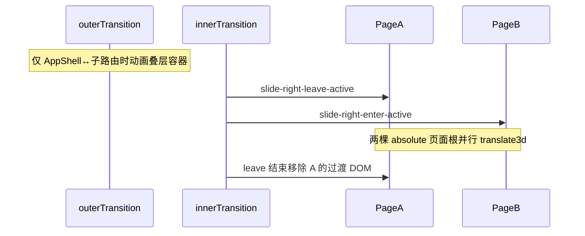

# Stack transition animation（通用规范）

本文件为 [SKILL.md](../SKILL.md) 的补充。新项目 **必须** 按此规范实现子页转场 CSS，与路由守卫写入的 `routeTransitionName` 严格一致。

可复制文件：

- 转场 keyframes：[../assets/page-transition.template.scss](../assets/page-transition.template.scss)
- 页面根绝对定位：[../assets/stack-page-layout.template.scss](../assets/stack-page-layout.template.scss)

## 1. 双层 transition 分工（参考壳层）

子页叠层推荐 **两层** `<transition :name="routeTransitionName">`，职责不同，**不要合并为一层**：

```vue
<!-- 外层：框架壳 ↔ 子路由叠层的进出场 -->
<transition :name="routeTransitionName">
  <div v-show="isStackOverlayVisible" class="stack-overlay-layer">
    <!-- 内层：叠层内子路由之间的切换（A↔B、列表↔详情） -->
    <transition :name="routeTransitionName">
      <keep-alive :include="cachedRouteNames">
        <router-view />
      </keep-alive>
    </transition>
  </div>
</transition>
```

| 层级 | 触发场景 | 动画对象 | 与缓存的关系 |
|------|----------|----------|--------------|
| **外层** | `AppShell`（`/`）↔ 任意子路由 | 整个 `.stack-overlay-layer` 容器进出场 | 配合 **`v-show`**（非 `v-if`）：离开 Tab 根时仅隐藏叠层，**不销毁**叠层 DOM；高频子页在 `keep-alive` 内保留实例，避免每次从 Tab 进入都重新挂载整条子栈 |
| **内层** | 子路由 ↔ 子路由（压栈/出栈） | `router-view` 渲染的页面组件根 | `keep-alive` 缓存列表等；`transition` 并行 enter/leave 产生两页滑动 |

`isStackOverlayVisible` 通常为 `$route.path !== '/'`。

外层用 `v-show` 的原因：从 Tab 再次进入同一子路由时，叠层容器与已缓存子页可快速恢复；`v-if` 会拆掉整棵子栈 DOM，与「高频子页」体验相悖。

## 2. 页面根节点必须 `position: absolute`（关键）

并行 enter/leave 时，**约 0.5s 内 DOM 上同时存在两个路由页面根节点**。若二者为默认文档流（`position: static`），会上下叠摞，**无法**形成横向「两页并列滑动」。

**通用规则：** 叠层内每个子路由页面的**顶层包裹**（如 `.page-root`、`.bg-html`）在 `.stack-overlay-layer` 下必须为：

```scss
.stack-overlay-layer {
  .page-root { /* 或项目约定的 .bg-html */
    position: absolute;
    top: 0;
    left: 0;
    right: 0;
    bottom: 0; /* 或 height: 100% */
    z-index: 1;
    overflow-y: auto;
    transform: translate3d(0, 0, 0);
  }
}
```

参考实现（hiking）：`src/styles/base.scss` 中 `.sub-page .bg-html`、`.sub-page .bg-common` 的 `position: absolute`。

模板：[../assets/stack-page-layout.template.scss](../assets/stack-page-layout.template.scss)

与转场配合：

- **叠层容器** `.stack-overlay-layer`：`position:absolute; overflow:hidden`（裁切视口）
- **页面根** `absolute`：使 leave/enter 两棵根节点**占同一叠层坐标系**，`translate3d` 横向滑动才正确
- 动画结束后 leave 根 DOM 移除，仅余当前路由一个根节点

## 3. 类名与 keyframes 契约（严格）

Vue 2 会根据 `name` 自动加 `{name}-enter`、`{name}-enter-active`、`{name}-leave-active` 等类：

| `routeTransitionName` | enter 初始类 | enter-active | leave-active | 离开终点 |
|----------------------|--------------|--------------|--------------|----------|
| `slide-left` | `opacity:0; translate3d(-100%,0,0)` | `slideInLeft` **0.5s** | `slideOutRight` **0.5s** | `translate3d(100%,0,0)` + `visibility:hidden` |
| `slide-right` | `opacity:0; translate3d(100%,0,0)` | `slideInRight` **0.5s** | `slideOutLeft` **0.5s** | `translate3d(-100%,0,0)` + `visibility:hidden` |

统一：**`translate3d`** + **`0.5s`**。完整 keyframes 见 [page-transition.template.scss](../assets/page-transition.template.scss)。

### 导航语义

| 用户操作 | `routeTransitionName` |
|----------|----------------------|
| 压栈 A→B | `slide-right` |
| 出栈 B→A | `slide-left` |
| 特殊全屏页退出 | `fade`（可选） |

## 4. 守卫如何设定 `routeTransitionName`

```javascript
if (overrideTransitionName) {
  transition = overrideTransitionName
  clearOverrideTransition()
} else if (to.name === 'AppShell') {
  transition = 'slide-left'
} else if (from.name === 'AppShell') {
  transition = 'slide-right'
} else {
  transition = 'slide-right'
}
```

- `goBack()` 必须先 `setOverrideTransition('slide-left')` 再 `router.go(-1)`
- `slide-right` 且 from 子页 → `addCachedRouteName(from.name)`

## 5. 为何看到「两个页面并列滑动」



- 内层 `<transition>` 默认**并行** enter/leave
- `keep-alive` 保留离开页实例；过渡 DOM 由 transition 管理
- **页面根 `absolute`** 是两页同屏横滑的前提（见 §2）

## 6. fade 扩展

```scss
.fade-enter-active, .fade-leave-active { transition: opacity 0.5s; }
.fade-enter, .fade-leave-active { opacity: 0; }
```

## 7. React 映射

- 双层：外层 AnimatePresence 控制 stack 显隐；内层控制 route 切换
- 每个 stack 页面根：`position: absolute; inset: 0`
- `framer-motion` 并行 exit/enter 模拟 slide-left/right
