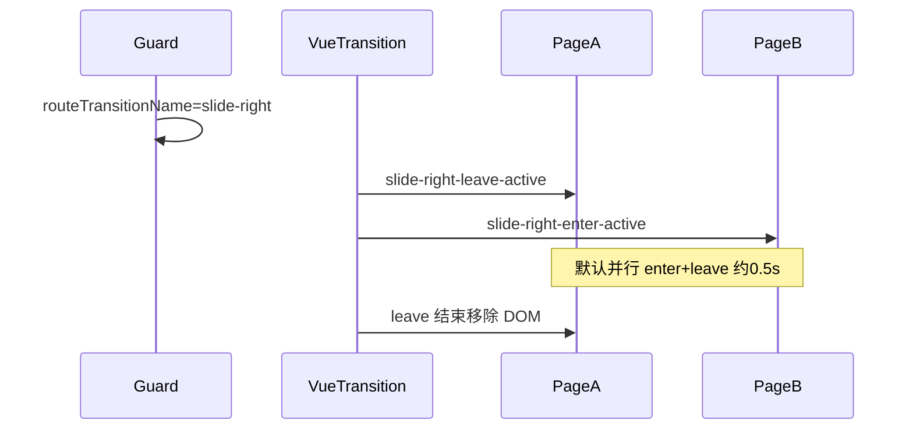

# Stack transition animation（通用规范）

本文件为 [SKILL.md](../SKILL.md) 的补充。新项目 **必须** 按此规范实现子页转场 CSS，与路由守卫写入的 `routeTransitionName` 严格一致。

可复制 SCSS：[../assets/page-transition.template.scss](../assets/page-transition.template.scss)

## 1. 壳层绑定

```vue
<div class="stack-overlay-layer">
  <!-- 推荐：仅一层 transition 包裹 router-view -->
  <transition :name="routeTransitionName">
    <keep-alive :include="cachedRouteNames">
      <router-view />
    </keep-alive>
  </transition>
</div>
```

- `routeTransitionName` 仅允许：`slide-right` | `slide-left` | `fade`（fade 为可选扩展）
- 由导航守卫 / store 在 `beforeEach` 内写入，壳层只读
- `.stack-overlay-layer`：`position:absolute; overflow:hidden; overscroll-behavior:contain`

**避免** 双层同名 `<transition>` 叠放（会加重动画、易闪烁）。

## 2. 类名与 keyframes 契约（严格）

Vue 2 会根据 `name` 自动加 `{name}-enter`、`{name}-enter-active`、`{name}-leave-active` 等类。下表为 **唯一合法** 映射：

| `routeTransitionName` | enter 初始类 | enter-active | leave-active | 离开终点 |
|----------------------|--------------|--------------|--------------|----------|
| `slide-left` | `opacity:0; translate3d(-100%,0,0)` | `slideInLeft` **0.5s** | `slideOutRight` **0.5s** | `translate3d(100%,0,0)` + `visibility:hidden` |
| `slide-right` | `opacity:0; translate3d(100%,0,0)` | `slideInRight` **0.5s** | `slideOutLeft` **0.5s** | `translate3d(-100%,0,0)` + `visibility:hidden` |

统一要求：

- 位移一律 **`translate3d`**，时长 **`0.5s`**
- 不要改类名前缀（否则与 `<transition :name>` 脱节）

### 导航语义

| 用户操作 | `routeTransitionName` | 视觉 |
|----------|----------------------|------|
| 压栈 A→B（列表→详情、子页→子页、AppShell→子页） | `slide-right` | 新页自右入；旧页向左出 |
| 出栈 B→A（详情→列表、子页→AppShell） | `slide-left` | 新页（底下页）自左入；旧页向右出 |
| 特殊全屏页退出 | `fade` | 透明度渐变（独立 CSS） |

命名记忆：**`slide-right` = 前进压栈**，**`slide-left` = 出栈返回**（不是「手指向左滑」）。

## 3. 守卫如何设定 `routeTransitionName`

```javascript
// 伪代码 — resolveTransition(to, from, overrideTransitionName)
if (overrideTransitionName) {
  transition = overrideTransitionName // goBack() 已设 slide-left
  clearOverrideTransition()
} else if (to.name === 'AppShell') {
  transition = 'slide-left'
} else if (from.name === 'AppShell') {
  transition = 'slide-right'
} else {
  transition = 'slide-right' // 子页→子页 默认压栈
}
```

**通用最佳实践（避免详情→列表动画反了）：**

- 返回按钮 / `goBack()`：**必须先** `setOverrideTransition('slide-left')` 再 `router.go(-1)`
- 或守卫增强：检测到「回到 `defaultCachedRouteNames` 中的路由」且为 pop 方向时强制 `slide-left`

压栈副作用（与动画联动）：

- `slide-right` 且 `from.name === 'AppShell'` → 延迟隐藏 MainTabLayer（防穿透）
- `slide-right` 且 `from` 为子页 → `addCachedRouteName(from.name)`（见 [scroll-restore-and-keepalive.md](scroll-restore-and-keepalive.md)）

## 4. 为何看到「两个页面并列滑动」



- `<transition>` **未设置** `mode="out-in"` → 进入页与离开页 **同时** 动画
- `keep-alive` → 离开页在动画期间 **实例仍在**，未销毁
- 两页根节点同处于 `.stack-overlay-layer` 视口内，通过 **transform** 横向错开，形成原生栈式滑动
- 动画结束后 Vue 移除离开页 DOM；进入页保留

若需「先走再走」：`<transition mode="out-in">`（会闪，一般不用于 App 栈）。

## 5. fade 扩展

`fade` 不放在 `page-transition.template.scss` 中；可用：

```scss
.fade-enter-active, .fade-leave-active { transition: opacity 0.5s; }
.fade-enter, .fade-leave-active { opacity: 0; }
```

仅用于与 slide 栈语义冲突的全屏页（如地图退出 Tab）。

## 6. React 映射

- `routeTransitionName` 存 Context
- `framer-motion` / `react-transition-group`：`slide-right` ≈ x: 100%→0 与 x: 0→-100% 并行
- 离开页组件保留在 cache Map 直至 exit 完成
